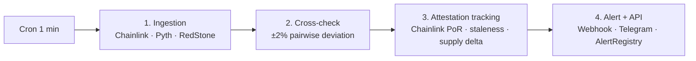

# SENTINEL — Lite Whitepaper v0.1

> 🚧 **DRAFT skeleton**. Sections marked `[FILL]` are for 김현우 + 모진영 to complete before 2026-04-27. Sections marked `[DIRECTIONAL]` are intentionally not final — subject to Phase 2 community input and independent audit.
>
> **Target**: 8–10 pages PDF after fill-in. Written for a crypto-native investor audience who knows DeFi, oracles, and basic tokenomics patterns.
>
> **Last updated**: 2026-04-19

---

## 1. Abstract

> **[FILL]** — 1 paragraph, ~150 words.
>
> Structure hint: RWA Sentinel is a progressively-decentralized public-goods watchdog for tokenized real-world assets on Base. In Phase 1, a centralized MVP monitors 5 priority assets with multi-oracle cross-checks and publishes alerts via an MIT-licensed API. In Phase 2, cross-check execution federates across 2–3 independent operators. In Phase 3, a permissionless operator network backed by the SENTINEL utility token opens participation to anyone and governs network parameters via token-weighted voting. This whitepaper introduces the problem (9 oracle incidents / ≥$50M / 18 months), the architecture, the token design, and the regulatory framing.

---

## 2. Problem

### 2.1 Pattern of oracle failures (leverages `.research/incident-forensics-moonwell.md`)

> **[FILL]** — Reuse the 9-incident table from the research doc. Cite specifically Moonwell cbETH (Feb 2026, $2.68M, 99.95% price deviation = 5,000× a 2% threshold) and Stream xUSD (Nov 2025, $93M contagion across Morpho/Euler/Silo/Gearbox).
>
> End with: "Every one of these incidents could have been detected in the same block via multi-oracle cross-check — but no existing public service performs this check."

### 2.2 Retail coverage gap (leverages `.research/competitor-architecture.md`)

> **[FILL]** — Summarize the competitor table: Chaos Labs enterprise-only (Aave $3M/yr engagements), Hypernative enterprise-only ($40M Series B but no retail), Forta migrated to paid FORT token subscription, RWA.xyz $500/seat/month with no alert layer, Chainlink PoR publishes data with no alert layer.
>
> Conclusion: **zero prior art serves retail holders with free, RWA-tuned, real-time alerts.**

### 2.3 Infrastructure without public-goods economics

> **[FILL]** — Argue that monitoring infrastructure must evolve like oracles did (from centralized services to decentralized token-coordinated networks). Reference the Chainlink → LINK pattern. Show that without a token, operator economics break at scale.

---

## 3. Architecture

### 3.1 Four-stage pipeline

The Sentinel runs as a four-stage pipeline. Stages 1–3 execute every minute on edge compute; stage 4 fans out off-chain alerts within 60 seconds and anchors the same alert on Base Mainnet within the next L2 block.

_Source: `docs/diagrams/architecture-pipeline.mmd`._

**Stage 1 — Ingestion.** A Cloudflare Worker (`apps/poller`) polls three independent oracle sources every minute for each Phase 1 asset: Chainlink via on-chain `latestRoundData()` reads (viem), Pyth via the sponsored push feeds and the Hermes pull endpoint (`@pythnetwork/pyth-evm-js`), and RedStone via REST. All values are normalized to 18 decimals before comparison. If fewer than two oracles respond for an asset, the stage logs `insufficient_sources` and skips that asset rather than emit a low-confidence alert.

**Stage 2 — Cross-check.** For each asset, the poller computes pairwise basis-point deviations across every available oracle pair. A configurable per-asset threshold (default ±2%; tightened to ±0.5% for stablecoins like USDC) determines whether the maximum deviation triggers an alert. The check is purely off-chain to keep latency under five seconds and cost under $55/month at scale — versus an estimated $8,700/month if every cross-check were executed on-chain (1 tx/min × 5 assets × ~21k gas at typical Base fees).

**Stage 3 — Attestation tracking.** For tokenized RWAs whose price is not market-discovered (e.g., USDO at Phase 1; cbBTC, iBTC, dlcBTC, GLDY, TETH from Phase 2), the poller subscribes to the issuer's Chainlink Proof-of-Reserve (PoR) feed on Base. The check flags two failure modes: **staleness** (no `AnswerUpdated` event within the heartbeat window) and **reserve-vs-supply delta** (PoR-reported reserves diverge from on-chain token total supply by more than a per-asset threshold). For Backed Finance products (bIB01, bCSPX) whose PoR feeds live on Polygon, Phase 2 introduces a Chainlink CCIP mirror to Base.

**Stage 4 — Alert and API.** Triggered alerts are published to a Cloudflare Queue and consumed by `apps/alert-writer`, which performs four actions in parallel: (a) `INSERT` into the D1 `alerts` table for audit, (b) submit `AlertRegistry.logAlert(...)` on Base Mainnet via a viem `walletClient` signed by the `PUBLISHER_PRIVATE_KEY` Worker secret, (c) `POST` to subscribed webhook URLs, and (d) call `bot.api.sendMessage()` (`grammy`) for subscribed Telegram chats. The public Hono API (`apps/api`) exposes read-only `/prices`, `/alerts`, and `/subscribers` endpoints. Phase 2 adds WebSocket streaming, Discord, and email channels; Premium-tier features (custom thresholds, historical export, SLA) layer on top of the same pipeline.

### 3.2 Phase 1 — Centralized MVP

Phase 1 ships a single-operator implementation of stages 1–4 with the on-chain audit log live on Base Mainnet. The split between off-chain compute and on-chain anchoring is deliberate: edge Workers give us sub-second latency and operating costs that fit a public-good budget, while the immutable contract gives any third party — auditors, journalists, future operators — the ability to verify our detection history without trusting our backend.

**On-chain (Base Mainnet).** `AlertRegistry.sol` is a 157-line MIT-licensed Foundry contract deployed at `0x79b5d74A301079c86D13eb71e2787852F403F876` on both Base Sepolia (block 40,619,999) and Base Mainnet (block 45,121,958). The address is identical on both chains because CREATE is deterministic from `(deployer, nonce=0)` and the deployer's first transaction on each chain is the registry deploy. The contract exposes `logAlert(asset, oraclePair, deviationBps, evidenceHash, alertType)` callable only by addresses present in the `isPublisher` mapping, an `AlertLogged` event for indexer consumption, and a 2-step admin rotation (`transferAdmin` → `acceptAdmin`) to guard against typos when transferring control to a multisig in Phase 2. Each `Alert` struct packs into four storage slots (down from six in the first draft) for an end-to-end gas cost of approximately 24,000 gas saved per alert. Source is verified on Basescan for both networks.

**Off-chain (Cloudflare Edge).** Three Workers run the pipeline: `apps/poller` (Cron-triggered every minute), `apps/alert-writer` (Queue consumer), and `apps/api` (Hono HTTP server). Persistent state lives in Cloudflare D1 (SQLite — `alerts`, `subscribers`, `price_history`), Cloudflare KV (`PRICES` namespace, 1-hour TTL for the public `/prices` endpoint), and Cloudflare Queues (`rwa-sentinel-alerts-{staging|production}`). All input validation uses zod; on-chain canonical encoding follows ADR 0007 (RFC 8785 JSON canonical form for `evidenceHash`) so that JS `keccak256(stringToBytes(...))` is bit-identical to Solidity `keccak256(bytes(...))`.

**Trust assumptions.** A user verifying an alert in Phase 1 trusts (a) Chainlink, Pyth, and RedStone to publish accurate prices, (b) Cloudflare to faithfully execute our open-source Worker code, and (c) the Oclix Labs publisher key not to falsify an `AlertLogged` event. Trust assumptions (a) are inherent to all oracle-based DeFi. Trust assumption (b) is mitigated in Phase 2 by adding 2–3 independent operators on different infrastructure providers. Trust assumption (c) is mitigated immediately by the append-only nature of the log (the publisher cannot delete or modify past entries) and rotated to a multisig before Phase 2.

### 3.3 Phase 2 — Federated Operators

Phase 2 federates stages 1–3 across 2–3 independent operators on different infrastructure (e.g., one Cloudflare, one Vercel/Fly.io, one self-hosted). A new on-chain contract, `OperatorRegistry.sol`, manages operator identity and a small ETH or stablecoin collateral bond (token does not yet exist). An off-chain aggregator — itself open-source and operable by any party — receives signed alerts from each operator and emits a high-confidence alert to `AlertRegistry` only when N-of-M operators agree. Single-operator alerts continue to publish under a "candidate" `alertType` for transparency. Coverage expands from 5 to 10–15 assets, including wstETH, USDT, DAI, EURC, cbBTC, LBTC, and USDe. The Premium tier (custom thresholds, historical export, real-time WebSocket) goes generally available with a $5K MRR target by end of phase. A third-party security audit (Trail of Bits, ChainSecurity, or Halborn) covers `AlertRegistry` and `OperatorRegistry` before pre-seed deployment. Token economics are designed and published in Whitepaper v1.0; the airdrop allocation registry begins recording subscribers and contributors, but no token is issued during Phase 2.

### 3.4 Phase 3 — Permissionless Network

Phase 3 migrates the full network on-chain. `StakingManager.sol` accepts SENTINEL bonds from any address that wishes to run an operator. `SubscriptionRouter.sol` routes both pay-per-period and stake-to-subscribe payments to operators, the ecosystem fund, and (where legal) a buy-back-and-burn function. `Governance.sol` (Compound Bravo–style with a Security Council 5-of-7 multisig veto during bootstrap) governs deviation thresholds, asset coverage, slashing parameters, and ecosystem fund disbursements. `EcosystemFund.sol` is the DAO-controlled treasury. The SENTINEL utility token launches on Base with Chainlink CCIP extensions to Ethereum and Optimism. Coverage expands to 30+ tokenized RWAs including newly emerging Base issuers. Slashing for false alerts (contradicted by ≥N independent operators), missed alerts (failed to detect a deviation that ≥N other operators did), and downtime is enforced on-chain. The free public alert tier is constitutionally guaranteed across all phases — Premium and token-paid tiers layer on top, never replace.

---

## 4. Tokenomics framework **[DIRECTIONAL]**

> SENTINEL is the utility token of the Phase 3 permissionless operator network. The framework below is **directional**: category allocations are locked, but exact percentages, total supply, and emission curve are intentionally deferred to Phase 2 community input and an independent economic audit. Full long-form spec: [`docs/TOKENOMICS-OUTLINE.md`](./TOKENOMICS-OUTLINE.md).

### 4.1 Utility — four functional pillars

SENTINEL exists because four functional requirements of a decentralized public-goods watchdog cannot be satisfied without a token. The same reasoning that produced LINK, GRT, and FIL applies: at meaningful scale, sustained open operator economics requires aligned incentives.

1. **Operator staking and slashing.** Operators bond SENTINEL to participate in the cross-check network. Bond size is governance-set and scales with the operator's asset coverage. Slashing fires for false alerts (contradicted by ≥N independent operators — linear slash), missed alerts (failed to detect a deviation that ≥N other operators did — linear slash), and downtime beyond SLA (graduated slash). Slashed tokens flow to the Ecosystem Fund, **not to other operators**, to prevent adversarial slashing as an attack vector.
2. **Subscription payment.** Premium-tier subscribers choose between pay-per-period (SENTINEL transferred each billing cycle) and stake-to-subscribe (SENTINEL locked for the subscription duration, no spend, unlocked on cancellation). The dual model preserves spend-based revenue while incentivizing long-term alignment from stakers.
3. **Governance.** Token-weighted voting with timelock governs deviation thresholds per asset class, asset coverage additions and removals, slashing parameters, ecosystem fund disbursements, and protocol upgrades. The pattern is Compound Bravo, with a 5-of-7 Security Council multisig veto for emergency pauses during the Phase 3 bootstrap window.
4. **Ecosystem fund.** A DAO-controlled treasury funded by an initial allocation, slashed operator stakes, and a governance-set share of subscription revenue. Disburses to security audits, grants to asset-coverage contributors, bug bounties, legal reserves, marketing, and integrations.

### 4.2 Allocation framework

Category labels are locked. Percentages are deferred to Phase 2.

| Category | Direction | Vesting | Purpose |
|---|---|---|---|
| **Operator Incentives** | largest | 10-year linear emission | Sustain operator network; emission curve set by governance |
| **Community / Early Subscribers** | substantial | None or 6-month linear | Phase 1–2 subscribers, GitHub contributors, research contributors; bootstrap decentralization narrative |
| **Ecosystem Fund** | meaningful | DAO controlled | Audits, grants, emergency response, legal reserves |
| **Team & Advisors** | modest | 4 years, 1-year cliff | Long-term commitment; standard crypto-native schedule |
| **Investors** | proportional to capital raised | 4 years, 1-year cliff | Pre-seed (Phase 2) + Seed/Series A (Phase 3); SAFT + warrants |

Three anti-patterns we explicitly avoid: (a) Team + Investors combined exceeding 30% (signals captured launch), (b) immediate unlock for any stakeholder (signals rug-pull), (c) Investor allocation exceeding Community (signals extractive launch).

### 4.3 Supply and emission

Fixed total supply, no inflation beyond the 10-year operator emission schedule. Direction is approximately 1 billion tokens — large enough to support fractional payments across many subscribers and small operator slashing increments without meme-coin aesthetics. At end of operator emission, network velocity is sustained entirely by subscription revenue and Ecosystem Fund disbursements.

### 4.4 Value capture

Four mechanisms tie token value to network success:

1. **Operator demand.** More assets monitored → more operators required → more SENTINEL bonded.
2. **Subscription demand.** More Premium subscribers → more SENTINEL spent or staked.
3. **Buy-back and burn** (where legal in applicable jurisdictions). A governance-set portion of subscription revenue buys SENTINEL on the open market and burns it.
4. **Staker yield.** Remaining subscription revenue flows to stakers — both operators and stake-to-subscribe holders. Stakers absorb dilution during operator emission and are compensated by subscription cash flow.

Equilibrium modeling — the precise relationship between coverage growth, subscription growth, emission rate, and staker yield — is deferred to Phase 2 alongside the independent economic audit.

### 4.5 Launch mechanism

A hybrid of three components, finalized by Phase 2 governance and investor input: a SAFT with warrants for Phase 2 and Phase 3 investors (accredited only), a community airdrop to Phase 1–2 subscribers and GitHub contributors weighted by tenure and activity, and a Liquidity Bootstrapping Pool (Balancer or Fjord-style) for price discovery. A pure fair launch (LBP + airdrop only, no pre-sale) is on the table but creates fundraising risk for continued development; the hybrid is the working baseline.

### 4.6 Parameters explicitly not set in v0.1

Exact supply, exact category percentages, emission curve shape, slashing severity percentages, the buyback-vs-yield revenue split, governance quorum and voting threshold, and Security Council membership are all deferred to Phase 2 / early Phase 3 community input and an independent economic audit by a firm experienced in token-economy design. See [`docs/TOKENOMICS-OUTLINE.md`](./TOKENOMICS-OUTLINE.md) §8 for the full list.

---

## 5. Governance

> **[FILL]**
>
> - Compound Bravo–style timelock governance in Phase 3
> - Security Council multisig (5-of-7) with emergency-pause veto during bootstrap
> - Governable parameters: deviation thresholds, heartbeat requirements, asset coverage additions, slashing severity, ecosystem fund disbursements
> - Governance migration timeline: Phase 1 = team multisig, Phase 2 = team + advisor council, Phase 3 = token-weighted DAO

---

## 6. Security

> **[FILL]**
>
> - Phase 1: Public repo, self-audit, community review
> - Phase 2: Third-party security audit (Trail of Bits / ChainSecurity / Halborn or equivalent)
> - Phase 3: Immunefi bug bounty program + ongoing audits
> - Economic audit (token design): Gauntlet, Delphi Digital, or equivalent before Phase 3 launch
> - Oracle manipulation resistance: multi-source design inherently hardens against single-oracle attacks
> - Alert-delivery DoS resistance: rate limits, signature verification for webhook authenticity

---

## 7. Roadmap

> **[FILL]** — Reference `docs/ROADMAP.md`. 1 page timeline with Phase 1/2/3 milestones and success criteria.

---

## 8. Regulatory considerations

SENTINEL is designed as a **utility token** with a consumption mechanism (subscription, slashing) live from launch and real (non-cosmetic) governance rights — the two properties most often cited in distinguishing utility tokens from securities under the Howey framework. This section summarizes the regulatory posture; a full factor-by-factor Howey analysis and a multi-jurisdiction legal opinion are produced as a separate pre-launch legal document, not in this whitepaper.

**Phases 1 and 2 operate without any token.** This is intentional: it minimizes regulatory surface during the period when network utility is being validated, and it avoids the "token first, utility later" pattern that has triggered enforcement action against prior infrastructure projects. No token is sold, distributed, or promised in exchange for participation in Phase 1 or Phase 2.

**Multi-jurisdiction legal review is continuous.** Counsel in the United States, Korea, Singapore, and the Cayman Islands review the protocol and token design on an ongoing basis. The Phase 3 launch is contingent on favorable opinions in the relevant jurisdictions.

**Sale structure avoids US retail public offering.** Token allocation to investors is via SAFT (Simple Agreement for Future Tokens) with warrants, restricted to accredited investors as defined under Rule 501(a) of Regulation D and the equivalent local frameworks elsewhere. Nothing in this whitepaper constitutes an offer to sell or a solicitation to buy any security to or from any person in the United States or any other jurisdiction in which such offer or solicitation would be unlawful.

**The community airdrop design is pending Korean legal review.** Several Phase 1 contributors (including the Oclix Labs founding team) are Korean residents. Airdrop eligibility for Korean residents is being reviewed against the Virtual Asset User Protection Act and related Financial Services Commission guidance before any allocation registry is finalized.

**Howey-test factor analysis** — investment of money, common enterprise, expectation of profit, derived from the efforts of others — is deferred to the pre-launch legal document. The token's utility (operator bonding, subscription payment, governance) is operational from genesis, which materially weakens factor 4 (efforts of others) compared with infrastructure tokens that launched without functional utility.

Specific risks and disclaimers — including that token value may fluctuate significantly, that nothing here is investment advice, and that the project may be required to make material design changes in response to legal opinion — appear in §10 below.

---

## 9. Team

> **[FILL]** — 0.5 page.
>
> - 4 co-founders from Yonsei University BAY Blockchain Society
> - Individual bios (see `docs/TEAM.md`)
> - Advisory / research partners (Anthias Labs, BAY faculty mentor if applicable — TBD)

---

## 10. Risks & Disclaimers

### 10.1 Regulatory uncertainty
The legal status of digital assets varies by jurisdiction and continues to evolve. SENTINEL is designed as a utility token for network participation, staking, and governance. Nothing in this document constitutes an offer to sell or a solicitation to buy any security. Token-related activities described in Phase 3 are contingent on favorable legal review in relevant jurisdictions.

### 10.2 Technical risk
Smart contracts are subject to bugs, economic attacks, and oracle failures. The project will commission third-party audits prior to Phase 2 and Phase 3 contract deployments. Users should understand that no security guarantees are absolute.

### 10.3 Execution risk
The roadmap spans multiple years. Market, team, and regulatory conditions may force material changes. Phase 3 features (permissionless operator network, token launch) are aspirational and require successful completion of Phase 1 and Phase 2 milestones.

### 10.4 Token value risk
Where issued, SENTINEL token value may fluctuate significantly. Purchasers should have a long-term horizon and understand that no price stability is implied. Historical performance of similar protocol tokens does not predict future outcomes.

### 10.5 No investment advice
This document is informational. Prospective participants should consult qualified legal, tax, and financial advisors.

### 10.6 Team liability limitations
Individual team members, including founders, shall not be personally liable for network operations once decentralized control transitions to the DAO.

---

## Appendix A: Glossary

Defined for the cross-functional reader: a tokenized-RWA-curious investor who knows DeFi at a high level but may not have hands-on experience with oracle infrastructure or token-economy design. Terms are grouped for lookup, not alphabetical.

### Oracles & price feeds

- **Oracle** — A service that publishes off-chain data (price, reserves, weather, sports scores) onto a blockchain so smart contracts can consume it. Almost every DeFi lending market, derivative, and stablecoin price depends on at least one oracle.
- **Chainlink** — The largest decentralized oracle network. On Base, prices are typically read via the `latestRoundData()` function on per-asset proxy contracts (e.g., BTC/USD at `0x64c911...848F`).
- **Pyth Network** — An oracle designed for low-latency price feeds, originally on Solana, now multi-chain. Two consumption models on Base: **sponsored push feeds** (Pyth pushes updates on-chain on a heartbeat) and **pull via Hermes** (clients fetch a signed price update from the Hermes REST endpoint and submit it to the on-chain Pyth contract).
- **RedStone** — A modular oracle that publishes prices off-chain (REST and signed messages) with on-chain settlement on demand. Lower update frequency than Chainlink/Pyth on Base today.
- **Heartbeat** — The maximum interval between oracle updates regardless of price movement. A 24-hour heartbeat with a 0.5% deviation trigger means: update on either ≥24h elapsed or ≥0.5% price change, whichever comes first.
- **Deviation threshold (basis points)** — The price change required to trigger an oracle to publish a new value, expressed in bps (1% = 100 bps). Sentinel's cross-check operates on the **deviation between two oracles**, distinct from any single oracle's own update threshold.
- **Proof-of-Reserve (PoR)** — A Chainlink product where an off-chain attester (typically the issuer or its custodian) publishes the asset's backing reserves on-chain on a heartbeat, allowing smart contracts to enforce reserve-to-supply invariants.
- **Staleness** — A PoR or price feed that has not updated within its heartbeat window. Often the first symptom of an oracle outage.
- **Reserve-vs-supply delta** — The difference between an issuer's PoR-reported reserves and the on-chain total supply of its token. A growing delta can indicate over-issuance, custodial loss, or PoR pipeline failure.

### Tokenized real-world assets

- **Tokenized RWA (Real-World Asset)** — A blockchain token whose value derives from an off-chain asset: US Treasuries, real estate, private credit, gold. Examples on Base include USDO (OpenEden tokenized Treasuries), cbBTC (Coinbase wrapped BTC), Backed Finance bIB01 / bCSPX (tokenized ETFs).
- **OEV wrapper (Oracle Extractable Value wrapper)** — A contract layer that wraps an oracle to capture or redirect value from MEV-style oracle frontrunning. Misconfiguration of an OEV wrapper was the proximate cause of the Moonwell cbETH February 2026 incident.
- **MEV (Maximal Extractable Value)** — Profit a block producer or sophisticated actor can extract by reordering, inserting, or censoring transactions in a block. Oracle MEV refers specifically to extraction enabled by predictable oracle updates.

### Sentinel-specific

- **Cross-check** — Sentinel's core mechanism: comparing two or more independent oracle prices for the same asset and flagging any pairwise deviation that exceeds a per-asset threshold.
- **AlertRegistry** — The append-only Solidity contract on Base where Sentinel writes every detected deviation. Same address (`0x79b5d74A301079c86D13eb71e2787852F403F876`) on Sepolia and Mainnet by CREATE determinism.
- **Append-only log** — A data structure where entries can only be added, never modified or deleted. Provides public verifiability without requiring trust in the operator.
- **Evidence hash** — `keccak256` hash of the canonical-encoded JSON evidence payload (RFC 8785) submitted to `AlertRegistry`. Allows the off-chain payload to be verified against the on-chain commitment.
- **Insufficient sources** — A skip condition: when fewer than two oracles respond for an asset on a given tick, the cross-check is not performed and the event is logged for observability.
- **Phase 1 / 2 / 3** — Sentinel's progressive decentralization stages (centralized MVP → federated operators → permissionless network). See §3.2–3.4.

### Token economy & governance

- **Progressive decentralization** — A pattern (Chainlink, Uniswap, Compound) where a single team operates a service centrally during validation, then transitions through federation to a permissionless token-secured network. Reduces regulatory and execution risk during early phases.
- **Staking** — Locking a token as collateral to participate in a network's operations, with the lock subject to slashing for misbehavior.
- **Slashing** — Forfeiting a portion of staked tokens as punishment for protocol violations (false alerts, missed alerts, downtime). Slashed tokens flow to Sentinel's Ecosystem Fund, not to other operators.
- **N-of-M consensus** — Phase 2 mechanism where a high-confidence alert requires agreement from N out of M independent operators before publishing. Reduces single-operator false-positive risk.
- **DAO (Decentralized Autonomous Organization)** — An organization governed by token-weighted voting rather than a central management team. Phase 3 transitions parameter changes (thresholds, asset coverage, treasury) to a DAO.
- **Timelock** — A mandatory delay between a governance vote passing and the change taking effect. Allows token holders to exit (or coordinate a counter-action) before a contentious change executes.
- **Security Council** — A small multi-signature group with limited emergency powers (typically pause-only) during Phase 3 bootstrap. Sentinel's design specifies a 5-of-7 multisig with veto over emergency parameter pauses, sunset by governance.
- **Ecosystem Fund** — A DAO-controlled treasury funded by initial allocation, slashed stakes, and a share of subscription revenue. Disburses to audits, grants, bug bounties, and operational reserves.

### Token launch & legal

- **SAFT (Simple Agreement for Future Tokens)** — A contract sold to accredited investors representing a right to receive tokens at a future network launch. Used to raise capital before token issuance while staying inside US private-placement exemptions.
- **LBP (Liquidity Bootstrapping Pool)** — A Balancer or Fjord-style price-discovery mechanism where a token launches with a high starting price that decays over time, allowing organic price discovery without front-running.
- **Howey test** — The four-factor US Supreme Court test (investment of money, common enterprise, expectation of profit, derived from the efforts of others) used to determine whether an instrument is an investment contract / security under US federal law.
- **Airdrop** — Distribution of tokens to a defined set of addresses (typically prior contributors or users) without payment, as a community-bootstrap mechanism.

### Stack & infrastructure

- **Base** — The Ethereum Layer 2 (L2) rollup operated by Coinbase, built on the Optimism Stack (OP Stack). Primary deployment target for Sentinel.
- **L2 (Layer 2)** — A blockchain that inherits security from a base layer (typically Ethereum) while executing transactions off the base layer at lower cost and higher throughput.
- **Cloudflare Workers** — A serverless edge compute platform. Sentinel's poller, alert-writer, and API run as Workers.
- **D1, KV, Queues** — Cloudflare's managed SQLite (D1), key-value store (KV), and message queue (Queues) primitives, all consumed from Workers via runtime bindings.
- **Hono** — A lightweight HTTP framework optimized for edge runtimes, used for Sentinel's public API.
- **viem** — A TypeScript client library for EVM chains. Sentinel uses `viem` for both reads (Chainlink `latestRoundData`) and writes (`AlertRegistry.logAlert`).
- **Foundry** — A Solidity development toolkit (`forge` for build/test, `cast` for RPC). Sentinel's contract test suite runs in Foundry.
- **CCIP (Cross-Chain Interoperability Protocol)** — Chainlink's framework for cross-chain message and token passing. Phase 2 uses CCIP to mirror Polygon-resident PoR feeds (Backed Finance bIB01/bCSPX) onto Base.
- **Immunefi** — The largest crypto bug-bounty platform. Phase 3 launches a Sentinel program there.

## Appendix B: Deferred parameters

> Section 4 (Tokenomics) and Section 8 (Regulatory) include explicit lists of parameters intentionally not set in v0.1. These appendices consolidate those for Phase 2 governance reference.

---

## References

- `docs/ROADMAP.md`
- `docs/TOKENOMICS-OUTLINE.md`
- `docs/APPLICATION-BM-DRAFTS.md`
- `.research/incident-forensics-moonwell.md`
- `.research/competitor-architecture.md`
- `.research/oracle-inventory-base.md`

---

## Review & approval workflow

- **Drafting (primary)**: **이재근 + 김현우** (co-authors)
  - **김현우**: Sections 1 (Abstract), 2 (Problem — cites `.research/`), 7 (Roadmap), 9 (Team), 10 (Risks)
  - **이재근**: Sections 3 (Architecture narrative), 4 (Tokenomics narrative), 8 (Regulatory framing), Appendix A (Glossary)
- **Technical input** (quick reviews, not drafting): 권상현 (Sections 5 Governance, 6 Security) + 모진영 (Section 3 technical accuracy, Section 4 value-capture mechanism)
- **Final approval**: 권상현 before any public release
- **Public release**: committed to repo + linked from `README.md` after Base Batches submission
