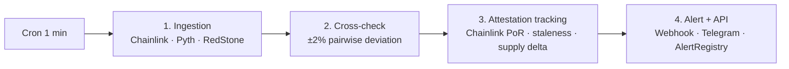

  

# RWA Sentinel

## Lite Whitepaper v0.1

### The Public Watchdog for Tokenized RWAs on Base

  

**Oclix Labs**
Yonsei BAY Blockchain Society
Seoul, Republic of Korea

 

**2026-04-27**

 

---

 

### Authors

| Member | Role |
|---|---|
| 권상현 (Kwon Sanghyun) | Team Lead · Smart Contract Engineer |
| 모진영 (Mo Jinyoung) | Core Engine · Backend · Infrastructure |
| 이재근 (Lee Jaegeun) | Marketing · Community · Frontend · Whitepaper |
| 김현우 (Kim Hyunwoo) | English · Research · Video · Documentation |

 

### Live deployment

**Mainnet contract** — `AlertRegistry.sol` at [`0x79b5d74A301079c86D13eb71e2787852F403F876`](https://basescan.org/address/0x79b5d74A301079c86D13eb71e2787852F403F876) (Basescan-verified)

**Landing page** — [oclixlabs.xyz](https://oclixlabs.xyz)

**Repository** — [github.com/Oclix-Labs/The-Sentinel](https://github.com/Oclix-Labs/The-Sentinel)

**Submission** — Base Batches 003 · Student Track

 

### License

This whitepaper is released under the **MIT License**. The Sentinel codebase, smart contracts, and operator client are MIT-licensed forever across all phases (per §7.4).

 

---

> 🚧 **Working draft v0.1.** Sections 1–11 and Appendices A–B are filled. Sections marked `[DIRECTIONAL]` (notably §4 Tokenomics) are intentionally not final — exact percentages, supply, and emission curve are deferred to Phase 2 community input and an independent economic audit. Individual team bios in §9 link to [`docs/TEAM.md`](./TEAM.md) and are finalized before PDF release.
>
> **Length**: ~40–45 pages PDF including the four-stage architecture diagram, threat-model and allocation tables, the Appendix A glossary, and the §11 Vision. Written for a crypto-native investor audience who knows DeFi, oracles, and basic tokenomics patterns. Scope is comparable to Chainlink v1 (~38 p) and RedStone (~35 p) whitepapers; this remains the "Lite" v0.1 versus the full Phase 2 Whitepaper v1.0 that will add formal protocol specs, full Howey-test analysis, and an economic-audit annex.
>
> **Last updated**: 2026-04-27.

## Table of Contents

1. [Abstract](#1-abstract)
2. [Problem](#2-problem)
   - 2.1 [Pattern of oracle failures](#21-pattern-of-oracle-failures)
   - 2.2 [Retail coverage gap](#22-retail-coverage-gap)
   - 2.3 [Infrastructure without public-goods economics](#23-infrastructure-without-public-goods-economics)
3. [Architecture](#3-architecture)
   - 3.1 [Four-stage pipeline](#31-four-stage-pipeline)
   - 3.2 [Phase 1 — Centralized MVP](#32-phase-1--centralized-mvp)
   - 3.3 [Phase 2 — Federated Operators](#33-phase-2--federated-operators)
   - 3.4 [Phase 3 — Permissionless Network](#34-phase-3--permissionless-network)
   - 3.5 [Why Base, specifically](#35-why-base-specifically)
   - 3.6 [Composability — Sentinel as a risk-event trigger primitive](#36-composability--sentinel-as-a-risk-event-trigger-primitive)
4. [Tokenomics framework](#4-tokenomics-framework-directional)
   - 4.0 [Founding principle — no team or investor genesis allocation](#40-founding-principle--no-team-or-investor-genesis-allocation)
   - 4.1 [Utility — four functional pillars](#41-utility--four-functional-pillars)
   - 4.2 [Allocation framework](#42-allocation-framework)
   - 4.3 [Supply and emission](#43-supply-and-emission)
   - 4.4 [Value capture](#44-value-capture)
   - 4.5 [Launch mechanism](#45-launch-mechanism)
   - 4.6 [Parameters explicitly not set in v0.1](#46-parameters-explicitly-not-set-in-v01)
5. [Governance](#5-governance)
   - 5.1 [Phase migration](#51-phase-migration)
   - 5.2 [Governable parameters](#52-governable-parameters)
6. [Security](#6-security)
   - 6.1 [Defensive posture per phase](#61-defensive-posture-per-phase)
   - 6.2 [Threat model](#62-threat-model)
   - 6.3 [Defense-in-depth mapping](#63-defense-in-depth-mapping)
   - 6.4 [Disclosure policy](#64-disclosure-policy)
7. [Roadmap](#7-roadmap)
   - 7.1 [Phase 1 — Centralized MVP (2026 Q2)](#71-phase-1--centralized-mvp-2026-q2)
   - 7.2 [Phase 2 — Federated Operators (2026 Q4 – 2027 Q1)](#72-phase-2--federated-operators-2026-q4--2027-q1)
   - 7.3 [Phase 3 — Permissionless Network + SENTINEL Token (2027 Q2+)](#73-phase-3--permissionless-network--sentinel-token-2027-q2)
   - 7.4 [Cross-phase constants](#74-cross-phase-constants)
8. [Regulatory considerations](#8-regulatory-considerations)
9. [Team](#9-team)
10. [Risks & Disclaimers](#10-risks--disclaimers)
    - 10.1 [Regulatory uncertainty](#101-regulatory-uncertainty)
    - 10.2 [Technical risk](#102-technical-risk)
    - 10.3 [Execution risk](#103-execution-risk)
    - 10.4 [Token value risk](#104-token-value-risk)
    - 10.5 [No investment advice](#105-no-investment-advice)
    - 10.6 [Team liability limitations](#106-team-liability-limitations)
    - 10.7 [Programmable alert reliance](#107-programmable-alert-reliance)
    - 10.8 [Fork risk and competitive moat narrowness](#108-fork-risk-and-competitive-moat-narrowness)
11. [Vision](#11-vision)
- Appendix A: [Glossary](#appendix-a-glossary)
- Appendix B: [Deferred parameters](#appendix-b-deferred-parameters)
- [References](#references)
- [Review & approval workflow](#review--approval-workflow)

## 1. Abstract

RWA Sentinel is a progressively-decentralized public-goods watchdog for tokenized real-world assets and price-bearing crypto assets on Base. Over the past eighteen months, at least nine oracle-composition or hardcoded-oracle failures across Base-adjacent DeFi caused **≥$50M in cumulative losses** — roughly one incident every two months — and no existing public service performs the multi-oracle cross-check that would have caught them in the same block. In Phase 1, a centralized MVP monitors five priority assets (BTC, ETH, USDC, cbETH, USDO) using two complementary detection mechanisms: **multi-oracle price cross-check** for assets with two or more public Base oracle feeds (BTC, ETH, USDC, cbETH), and **Chainlink Proof-of-Reserve attestation tracking** for tokenized real-world assets where multi-oracle coverage does not yet exist (USDO at Phase 1, expanding to cbBTC, iBTC, and Backed Finance products in Phase 2). Detected deviations and attestation anomalies are written to an append-only contract on Base Mainnet under MIT license. In Phase 2, cross-check execution federates across 2–3 independent operators with N-of-M consensus. In Phase 3, a permissionless operator network backed by the SENTINEL utility token opens participation to anyone and governs network parameters through token-weighted voting. This whitepaper presents the problem, the architecture, the directional token design, the regulatory framing, and the open risks — including the honest detection-vs-action limit, the asset-class scope of cross-check vs attestation tracking, and the operator economics of Phase 2. **Three structural forces converge through 2026** — Base RWA TVL approaching ~18× year-over-year growth, OpenZeppelin Defender's July 2026 retirement leaving the retail-facing programmable monitoring slot structurally empty, and AI-accelerated contract development (responsible for the very Moonwell cbETH incident this whitepaper references) outpacing manual code review at scale — that make this build window uniquely time-sensitive. Sentinel is the runtime safety net the AI-coding era requires: not a substitute for code review, but the only public mechanism that catches what review missed once code is live.

---

## 2. Problem

### 2.1 Pattern of oracle failures

The Phase 1 coverage choices and the urgency of this whitepaper are anchored in a specific empirical claim: oracle-composition failures have moved from rare to recurring across Base-adjacent DeFi, and the existing infrastructure has no public layer to catch them in real time.

In the eighteen months between October 2024 and April 2026, at least nine oracle-composition or hardcoded-oracle failures across Base and closely adjacent venues collectively destroyed or endangered **≥$50M in user and protocol funds**. The full forensic catalog is in [`.research/incident-forensics-moonwell.md`](../.research/incident-forensics-moonwell.md) with primary sources for each event; the headline cases are:

- **Moonwell cbETH (15 Feb 2026, Base).** A governance proposal (MIP-X43) — co-authored with AI assistance, with `Co-Authored-By: Claude Opus 4.6` trailers visible in the merged PR `moonwell-contracts-v2#578` — introduced an OEV wrapper that derived `cbETH/USD` from the raw `cbETH/ETH` ratio without multiplying by `ETH/USD`. The result: cbETH was reported at ~$1.12 instead of ~$2,200 — a **99.95% deviation**, or roughly 5,000× a 2% threshold. Liquidation bots seized 1,096.317 cbETH over a four-day window (delayed by Moonwell's ~5-day governance timelock), producing $1.78M protocol bad debt and **$2.68M net losses across ~181 borrowers**. Halborn had audited the affected codebase; unit tests existed in a separate PR; neither caught the unit-conversion error.
- **Stream Finance xUSD (4 Nov 2025, multi-protocol).** A fund-manager misappropriation of $93M depegged xUSD to ~$0.26, but Morpho, Euler, Silo, Gearbox, and Lista DAO had hardcoded `xUSD/USD = $1.00` oracles "to prevent mass liquidations". Lenders held worthless collateral with no liquidation path — **up to $285M at risk**, with Elixir deUSD collapsing 98% via contagion.
- **Aave wstETH CAPO (11 Mar 2026, Ethereum).** Chaos Labs' Correlated Asset Price Oracle's `snapshotRatio` and `snapshotTimestamp` desynchronized, mispricing the wstETH/stETH ratio by 2.85% — enough to forcibly liquidate 34 accounts for **~$27M**.

The pattern across all nine incidents is identical: the deviation between the protocol-consumed price and any independent reference price exceeded 2% — often by multiple orders of magnitude — for periods ranging from minutes to days. **Every one of these incidents could have been detected in the same block via multi-oracle cross-check — but no existing public service performs this check.**

**Why now — three structural forces converge through 2026.** This pattern is not stabilizing. (a) **Base RWA TVL growth.** L2-resident tokenized RWA value reached ~$1.1B in L2Beat's December 2025 monthly update — ~18× growth in 24 months — with Base capturing roughly 33% of L2 TVL share. New oracle composition surfaces (cbBTC, USDO PoR, ARKB, iBTC, GLDY, Backed Finance products via CCIP) emerge faster than any single risk team can review. (b) **Defender retirement.** OpenZeppelin Defender — the closest existing programmable-monitoring product retail builders have used — sunsets July 2026; the open-source replacement Monitor + Relayer is self-hosted and generic, neither RWA-tuned nor retail-facing. The hosted retail-facing programmable-monitoring slot is structurally empty. (c) **AI-accelerated contract development.** The Moonwell cbETH bug itself was AI-coauthored. The Protos forensic write-up notes "over 1,000 commits in a single week" upstream of the merge, characteristic of AI-assisted development now standard across DeFi. Subtle composition errors reach mainnet faster than the audit pipeline scales — Halborn audited Moonwell's contracts and unit tests existed; the unit-conversion bug still merged. **Detection-layer infrastructure that was 'nice to have' in 2024 becomes load-bearing in 2026** — and the AI-coding era will not slow down to wait for human review to catch up.

**Detection enables self-rescue, not protocol-level prevention.** Sentinel is a detection and alerting layer rather than a circuit-breaker (§6.2). Even instantaneous detection cannot stop a liquidation cascade once the affected protocol's own governance timelock outpaces detection — Moonwell's ~5-day timelock prevented the cbETH oracle config from being rolled back even after Anthias Labs identified the root cause within ~24 hours. Sentinel's value to a Moonwell borrower in that window is the few minutes they would have needed to withdraw, repay, or transfer collateral before liquidation bots arrived; it is not a protocol-side rescue. The Phase 2 webhook + Phase 3 token-paid SLA tier are designed for exactly this self-rescue use case (§3.1 Stage 4).

### 2.2 Retail coverage gap

If the cross-check is so simple, why has no incumbent built it for retail users? Because the existing competitive landscape is structurally enterprise-facing.

A complete competitor analysis lives in [`.research/competitor-architecture.md`](../.research/competitor-architecture.md); the relevant condensation is that every existing player serves protocols, issuers, or institutions, never retail holders:

- **Chaos Labs** runs governance-funded engagements with major DeFi protocols (Aave Horizon at ~$3M/year, scaling toward $8M); the institutional RWA product line is gated behind protocol-side contracts. No retail dashboard.
- **Hypernative** ($40M Series B, June 2025) protects "$100B+ onchain assets" across 250+ enterprise customers; pricing is sales-led and enterprise-only.
- **Forta Network** migrated from a free model to paid FORT-token subscription in early 2025 — the General plan is 250 FORT/month; alert quality varies per third-party bot, and Base coverage is not in the highlighted live deployments.
- **RWA.xyz** is read-only data: free tier provides three exports per month with no API, the Pro tier is **$500/seat/month** without an alert layer, and only Enterprise unlocks the API.
- **Chainlink Proof-of-Reserve** publishes attested reserves on-chain (USDO, ARKB, iBTC on Base) but emits no anomaly alerts and remains in self-attestation mode for a "small minority" of feeds. Consumers must build their own listeners.
- **OpenZeppelin Defender** is sunsetting in July 2026, replaced by an open-source Monitor + Relayer pair that users either self-host or buy as a managed service.

The result is a structural gap: **zero prior art serves retail holders with free, RWA-tuned, real-time alerts.** The closest adjacencies (Forta, OZ Monitor) are either paid-token-gated or self-host frameworks rather than hosted public services.

### 2.3 Infrastructure without public-goods economics

This gap is not a coincidence — it follows from the economics of monitoring infrastructure at scale.

Real-time multi-oracle cross-checking can be operated by a single team while the asset count is small and the team is grant-funded. Beyond Phase 2, however, the labor of running the network grows roughly linearly with asset coverage and operator redundancy: each new oracle integration, each new asset class, each false-positive dispute, and each on-chain governance change consumes operator hours that must be paid for. A team that cannot pay its operators degrades into an unreliable service or shutters; a team that pays them through subscription revenue alone is forced to charge for the public-good tier the moment Premium revenue underperforms — exactly the failure mode that turned Forta's free network into a paid FORT subscription.

The historical solution to this problem is the pattern Chainlink (LINK), The Graph (GRT), and Filecoin (FIL) followed: introduce a token only after the network has demonstrated utility, and restrict the token's role to functions the network genuinely cannot perform without it — operator sybil resistance, slashing recovery, and governance at scale. Without a token of its own, an open monitoring network either remains a single-team service with capped reliability or becomes an enterprise product. RWA Sentinel chooses the third path. The four functional pillars motivating SENTINEL are detailed in §4.1; the regulatory and timing framing is in §8.

---

## 3. Architecture

### 3.1 Four-stage pipeline

The Sentinel runs as a four-stage pipeline. Stages 1–3 execute every minute on edge compute; stage 4 fans out off-chain alerts within 60 seconds and anchors the same alert on Base Mainnet within the next L2 block.

_Source: `docs/diagrams/architecture-pipeline.mmd`._

**Stage 1 — Ingestion.** A Cloudflare Worker (`apps/poller`) polls every available oracle source for each Phase 1 asset on a 1-minute cadence. Phase 1 oracle coverage is uneven across assets — we report it explicitly rather than averaging it into a single "multi-oracle" claim:

| Asset | Chainlink | Pyth | RedStone | Mechanism |
|---|---|---|---|---|
| BTC / USD | ✅ | ✅ | ✅ | triple-source price cross-check |
| ETH / USD | ✅ | ✅ | ✅ | triple-source price cross-check |
| USDC / USD | ✅ | ✅ | ✅ | triple-source price cross-check |
| cbETH / USD | ✅ | ✅ | ❌ | **dual-source** price cross-check (RedStone has no Base cbETH feed at Phase 1) |
| USDO | PoR feed | n/a | n/a | single-source attestation tracking (Stage 3) |

Chainlink is read via on-chain `latestRoundData()` (viem); Pyth via sponsored push feeds and the Hermes pull endpoint (`@pythnetwork/pyth-evm-js`); RedStone via REST. All price values are normalized to 18 decimals before comparison. If fewer than two oracles respond for an asset that requires cross-check, the stage logs `insufficient_sources` and skips that asset rather than emit a low-confidence alert.

The dual-source coverage of cbETH is a known limitation: a simultaneous misconfiguration affecting both Chainlink and Pyth would produce a false negative in Phase 1. The Moonwell February 2026 incident would still have been caught (the misconfig affected only one source and produced a 99.95% deviation against the other), but the Phase 2 federation across 2–3 independent operators on different infrastructure providers is the structural answer to this single-feed-pair risk; in the meantime the cbETH threshold remains intentionally permissive (§3.1 Stage 2) to avoid false positives that would erode trust in the alert stream.

**Stage 2 — Cross-check.** For each asset, the poller computes pairwise basis-point deviations across every available oracle pair. A configurable per-asset threshold determines whether the maximum deviation triggers an alert. Default thresholds are calibrated by asset class to match the volatility regime of the underlying:

| Asset class | Default threshold | Rationale |
|---|---|---|
| Hard stablecoin (USDC, USDT, DAI, EURC) | ±0.5% | Designed to track $1; even a ±1% deviation is materially abnormal — see USDC March 2023, xUSD November 2025 |
| Yield-bearing stablecoin (USDe, sDAI) | ±1.0% | Allows for accrued yield drift; tighter than crypto, looser than hard stable |
| Liquid staking token (cbETH, wstETH, rsETH) | ±2.0% | Prices a multi-component (underlying + yield) ratio; small drift is normal — Moonwell Feb 2026 cbETH was 99.95%, ~5,000× this threshold |
| Crypto (BTC, ETH) | ±2.0% | Default; market volatility makes tighter thresholds noisy |
| Tokenized RWA with NAV oracle (USDO, OUSG, bIB01) | heartbeat-based + ±1.0% | Slow-moving NAV; staleness usually precedes deviation, see Stage 3 |

Per-asset overrides are recorded in the poller config and changed only via governance vote in Phase 3. The check is purely off-chain to keep latency under five seconds and cost under $55/month at scale — versus an estimated $8,700/month if every cross-check were executed on-chain (1 tx/min × 5 assets × ~21k gas at typical Base fees).

**Stage 3 — Attestation tracking.** For tokenized RWAs whose price is not market-discovered (e.g., USDO at Phase 1; cbBTC, iBTC, dlcBTC, GLDY, TETH from Phase 2), the poller subscribes to the issuer's Chainlink Proof-of-Reserve (PoR) feed on Base. The check flags two failure modes: **staleness** (no `AnswerUpdated` event within the heartbeat window) and **reserve-vs-supply delta** (PoR-reported reserves diverge from on-chain token total supply by more than a per-asset threshold). For Backed Finance products (bIB01, bCSPX) whose PoR feeds live on Polygon, Phase 2 introduces a Chainlink CCIP mirror to Base.

**Stage 4 — Alert and API.** Triggered alerts are published to a Cloudflare Queue and consumed by `apps/alert-writer`, which performs four actions in parallel: (a) `INSERT` into the D1 `alerts` table for audit, (b) submit `AlertRegistry.logAlert(...)` on Base Mainnet via a viem `walletClient` signed by the `PUBLISHER_PRIVATE_KEY` Worker secret, (c) `POST` to subscribed webhook URLs, and (d) call `bot.api.sendMessage()` (`grammy`) for subscribed Telegram chats. The public Hono API (`apps/api`) exposes read-only `/prices`, `/alerts`, and `/subscribers` endpoints. Phase 2 adds WebSocket streaming, Discord, and email channels; Premium-tier features (custom thresholds, historical export, SLA) layer on top of the same pipeline.

**Programmable alert hooks (Phase 2 Premium-tier flagship feature).** Beyond webhook and Telegram delivery, the `AlertLogged` event is pullable by any third party for downstream on-chain reactions in Phase 1 — a subscriber can run their own keeper (e.g., a Chainlink Automation upkeep) that watches the event and executes their own contract logic. Phase 2 introduces a **push-based programmable alert layer**: subscribers register a `SentinelReceiver` contract address, an asset filter, a custom payload (`bytes`), and a per-call gas budget against a small Premium-tier fee. The Phase 2 alert-writer fans out a single batched on-chain call across all active subscribers' receivers in the same block as the alert, with per-receiver gas limits and try/catch failure isolation so one receiver reverting cannot affect others. The interface mirrors the Chainlink CCIP destination-side execution pattern (`ccipReceive` → `onSentinelAlert(asset, deviationBps, evidenceHash, alertType, customPayload)`) and unlocks atomic detection-to-action workflows the existing detect-only watchdog landscape (Chaos Labs, Hypernative, Forta, OpenZeppelin Defender — the latter sunsetting July 2026) does not provide for retail subscribers. Concrete use cases: auto-withdraw from a lending protocol when collateral oracle deviates beyond a user-set threshold, auto-hedge a leveraged position, auto-pause a downstream protocol that consumes the flagged oracle, auto-migrate to a safer vault, or relay onward via Chainlink CCIP to an action contract on a different chain. Trust amplification risk and the carve-out between signal-delivery (Sentinel's responsibility) and action-execution (the user's receiver contract responsibility) are addressed in §6.2 (new threat-model row) and §10.7 (risk disclosure).

### 3.2 Phase 1 — Centralized MVP

Phase 1 ships a single-operator implementation of stages 1–4 with the on-chain audit log live on Base Mainnet. The split between off-chain compute and on-chain anchoring is deliberate: edge Workers give us sub-second latency and operating costs that fit a public-good budget, while the immutable contract gives any third party — auditors, journalists, future operators — the ability to verify our detection history without trusting our backend.

**On-chain (Base Mainnet).** `AlertRegistry.sol` is a 157-line MIT-licensed Foundry contract deployed at `0x79b5d74A301079c86D13eb71e2787852F403F876` on both Base Sepolia (block 40,619,999) and Base Mainnet (block 45,121,958). The address is identical on both chains because CREATE is deterministic from `(deployer, nonce=0)` and the deployer's first transaction on each chain is the registry deploy. The contract exposes `logAlert(asset, oraclePair, deviationBps, evidenceHash, alertType)` callable only by addresses present in the `isPublisher` mapping, an `AlertLogged` event for indexer consumption, and a 2-step admin rotation (`transferAdmin` → `acceptAdmin`) to guard against typos when transferring control to a multisig in Phase 2. Each `Alert` struct packs into four storage slots (down from six in the first draft) for an end-to-end gas cost of approximately 24,000 gas saved per alert. Source is verified on Basescan for both networks.

**Off-chain (Cloudflare Edge).** Three Workers run the pipeline: `apps/poller` (Cron-triggered every minute), `apps/alert-writer` (Queue consumer), and `apps/api` (Hono HTTP server). Persistent state lives in Cloudflare D1 (SQLite — `alerts`, `subscribers`, `price_history`), Cloudflare KV (`PRICES` namespace, 1-hour TTL for the public `/prices` endpoint), and Cloudflare Queues (`rwa-sentinel-alerts-{staging|production}`). All input validation uses zod; on-chain canonical encoding follows ADR 0007 (RFC 8785 JSON canonical form for `evidenceHash`) so that JS `keccak256(stringToBytes(...))` is bit-identical to Solidity `keccak256(bytes(...))`.

**Trust assumptions.** A user verifying an alert in Phase 1 trusts (a) Chainlink, Pyth, and RedStone to publish accurate prices, (b) Cloudflare to faithfully execute our open-source Worker code, and (c) the Oclix Labs publisher key not to falsify an `AlertLogged` event. Trust assumptions (a) are inherent to all oracle-based DeFi. Trust assumption (b) is mitigated in Phase 2 by adding 2–3 independent operators on different infrastructure providers. Trust assumption (c) is mitigated immediately by the append-only nature of the log (the publisher cannot delete or modify past entries) and rotated to a multisig before Phase 2.

### 3.3 Phase 2 — Federated Operators

Phase 2 federates stages 1–3 across 2–3 independent operators on different infrastructure (e.g., one Cloudflare, one Vercel/Fly.io, one self-hosted). A new on-chain contract, `OperatorRegistry.sol`, manages operator identity and a small ETH or stablecoin collateral bond (token does not yet exist). An off-chain aggregator — itself open-source and operable by any party — receives signed alerts from each operator and emits a high-confidence alert to `AlertRegistry` only when N-of-M operators agree. Single-operator alerts continue to publish under a "candidate" `alertType` for transparency. Coverage expands from 5 to 10–15 assets, including wstETH, USDT, DAI, EURC, cbBTC, LBTC, and USDe. The Premium tier (custom thresholds, historical export, real-time WebSocket) goes generally available with a $5K MRR target by end of phase. A third-party security audit (Trail of Bits, ChainSecurity, or Halborn) covers `AlertRegistry` and `OperatorRegistry` before pre-seed deployment. Token economics are designed and published in Whitepaper v1.0; the airdrop allocation registry begins recording subscribers and contributors, but no token is issued during Phase 2.

**Phase 2 operator compensation.** Without an issued token, Phase 2 operator economics rely on three explicit streams: (a) a USDC service contract from Oclix Labs Inc paid out of Phase 2 pre-seed capital (≈$2–5K/month per operator instance, comparable to a part-time SRE retainer; precise rates set per operator at registration time), (b) a written commitment to allocate a portion of the Phase 3 Operator Incentives pool to verified Phase 2 operators with the same 4-year vest / 1-year cliff applied to founder operators in §4.0 (recorded in the airdrop allocation registry, minted at Phase 3 launch like any other community allocation — consistent with the §4.0 commitment that no token is *issued* during Phase 2), and (c) the right to participate in the Phase 3 permissionless network without re-registration. The realistic Phase 2 operator count is **2 (founder team + one external partner) by default, expanding to 3 only when a self-funded operator candidate emerges** — the whitepaper does not assume every Phase 2 candidate will materialize. Candidate partners under early discussion include Anthias Labs (Moonwell risk manager, first public detector of the cbETH incident referenced in §2.1) and Steakhouse Financial; engagement is contingent on Phase 1 milestone completion.

### 3.4 Phase 3 — Permissionless Network

Phase 3 migrates the full network on-chain. `StakingManager.sol` accepts SENTINEL bonds from any address that wishes to run an operator. `SubscriptionRouter.sol` routes both pay-per-period and stake-to-subscribe payments to operators, the ecosystem fund, and (where legal) a buy-back-and-burn function. `Governance.sol` (Compound Bravo–style with a Security Council 5-of-7 multisig veto during bootstrap) governs deviation thresholds, asset coverage, slashing parameters, and ecosystem fund disbursements. `EcosystemFund.sol` is the DAO-controlled treasury. The SENTINEL utility token launches on Base with Chainlink CCIP extensions to Ethereum and Optimism. Coverage expands to 30+ tokenized RWAs including newly emerging Base issuers. Slashing for false alerts (contradicted by ≥N independent operators), missed alerts (failed to detect a deviation that ≥N other operators did), and downtime is enforced on-chain. **Programmable alert hooks introduced in Phase 2 evolve in Phase 3 to support both USDC Premium subscription (paid to Oclix Labs Inc as the SaaS provider) and SENTINEL stake-to-subscribe (routed through `SubscriptionRouter`) through the same `SentinelReceiver` interface — subscribers choose the payment path, the on-chain action surface is identical.** Oclix Labs Inc continues as the SaaS provider and Premium service operator throughout Phase 3, alongside the permissionless decentralized network; the two cap tables (Oclix Labs Inc equity and SENTINEL token) remain legally and operationally separate as established in §4.0. The free public alert tier is constitutionally guaranteed across all phases — Premium and token-paid tiers layer on top, never replace.

### 3.5 Why Base, specifically

The architecture above could in principle deploy on any EVM-compatible Layer 2. Base is the only chain where four constraints align simultaneously, and Sentinel's design is not portable away from this alignment without material loss of value:

1. **Native retail distribution.** Coinbase Wallet, Farcaster, and Basenames give Base — uniquely among production L2s — a built-in retail surface that does not require user education. Sentinel's target audience is the retail RWA holder who lost $11K in the Moonwell incident, not an institutional risk team. That audience is reachable on Base through wallet-native notifications, Farcaster channels, and Basename resolution; on Optimism, Arbitrum, or Polygon the same audience would require multi-platform marketing spend that a public-good budget cannot support.

2. **RWA issuer concentration.** USDO (OpenEden), cbBTC (Coinbase), ARKB / iBTC (institutional ETPs), GLDY (Streamex tokenized gold), and Backed Finance products (bIB01, bCSPX) via CCIP all live on or are bridging to Base. The supply side is structurally on Base in 2026 — Chainlink Proof-of-Reserve feeds for these assets are deployed on Base, not other L2s. Monitoring infrastructure must follow the issuers.

3. **Anchoring cost economics.** Base transaction fees are the lowest among production L2s. Sentinel's average alert anchoring cost is approximately **$0.007 per alert at deployment-day Base fees** versus an estimated ~$0.02 on Optimism and ~$0.01 on Arbitrum. At Phase 3's 30+ asset coverage and 1-minute polling cadence, this 2–3× cost difference compounds to material operator-economics drag elsewhere.

4. **Regulatory alignment.** Coinbase is an NYSE-listed company under continuous SEC scrutiny — its risk posture flows to Base by adjacency. This conservatism aligns precisely with Sentinel's no-team-token / no-investor-token / SaaS-revenue-only structure (§4.0). Building this exact product on a chain whose backing entity is incentivized toward token-first models would create regulatory friction we do not need.

This is not "Base because Coinbase Ventures might fund us"; it is the chain choice the architecture forces once the retail public-good premise is fixed.

### 3.6 Composability — Sentinel as a risk-event trigger primitive

Programmable alert hooks (§3.1 Stage 4) are not just a Premium feature for end users; they make Sentinel a primitive that other DeFi protocols compose on top of. The pattern parallels Chainlink Automation (scheduled trigger primitive), Gelato Network (off-chain relay primitive), Pyth Hermes (price-update primitive), and Chainlink CCIP (cross-chain message primitive) — each became infrastructure that other protocols built on. Sentinel occupies the **risk-event trigger primitive** category: an oracle anomaly, PoR drift, or cross-source deviation event becomes a callable signal that downstream contracts react to atomically through the `SentinelReceiver` interface.

Five canonical Phase 2+ compositions, in order of integration cost:

1. **Insurance protocols.** Depeg / oracle-failure coverage products (Cozy Finance and Y2K Finance patterns) register a `SentinelReceiver` that triggers automatic payout on a verified Sentinel alert. The insurance protocol no longer needs to operate its own oracle-watching infrastructure or build a dispute-resolution layer for "did the depeg actually happen?".
2. **Lending protocol curators.** Morpho / Euler / Spark vault curators register hooks that call `pause()` on their market when Sentinel detects collateral oracle deviation. Phase-aligned with the Moonwell post-mortem: a curator-side auto-pause on cross-check failure prevents the multi-day liquidation cascade that the protocol's own governance timelock cannot.
3. **RWA issuer self-monitoring.** Issuers (OpenEden for USDO, future cbBTC issuers, Backed Finance for tokenized ETPs) register hooks that halt their own minting when reserve-vs-supply delta exceeds a self-defined threshold. The issuer demonstrates supply-side discipline auditable by their regulators without trusting any single external monitor.
4. **DEX aggregator routing.** 1inch, 0x, Matcha consume the public Sentinel API to down-weight or exclude assets with active alerts from default routing. User-side risk reduction with no UI change required.
5. **Wallet provider native warnings.** Coinbase Wallet, MetaMask, Rabby render native warnings when a user attempts to transact in an asset Sentinel currently flags. Distribution multiplier with no explicit subscription required.

Each composition is a B2B revenue tier in Phase 2+ Premium pricing: retail Premium at $20–50/month, B2B composition tier at $500–2,000/month per integrating protocol depending on alert volume and SLA, Enterprise white-label pricing for major wallet/DEX integrations. The composability thesis is what turns Sentinel from a retail-facing product (on its own a niche TAM) into the **default risk-event primitive of the Base ecosystem**, a TAM that scales with Base's RWA growth (§3.5) rather than with the Sentinel team's marketing reach. Each new composition increases the weight of every Sentinel alert (more downstream consumers), which in turn makes the network a stronger default for the next composition — a flywheel that operates regardless of token-price action.

---

## 4. Tokenomics framework **[DIRECTIONAL]**

> SENTINEL is the utility token of the Phase 3 permissionless operator network. The framework below is **directional**: exact percentages, total supply, and emission curve are deferred to Phase 2 community input and an independent economic audit. The structural commitments — described in §4.0 — are firm. Full long-form spec: [`docs/TOKENOMICS-OUTLINE.md`](./TOKENOMICS-OUTLINE.md).

### 4.0 Founding principle — no team or investor genesis allocation

The four founders of Oclix Labs and any future Phase 2 investors do **not** receive a SENTINEL token allocation at genesis. Founders may participate in the Phase 3 permissionless operator network on the same terms as any external operator, but founder-earned operator emission is additionally subject to a **4-year vest with 1-year cliff** and an aggregate **5% cap** on total operator emission. Phase 2 funding flows into **Oclix Labs Inc** — the SaaS company that operates Premium subscription services on top of the public-good token network — through USD-denominated SAFE or priced equity rounds. There is no SAFT, no token warrant, no pre-launch private sale, and no token-for-service swap to any party at any time.

This separation mirrors the **Vercel / Next.js** and **Apollo GraphQL / Apollo Server** patterns: the protocol token coordinates an open public-good operator network; the corporation captures value from hosted services on top. The materially weakened Howey factor 4 analysis in §8 is a direct structural consequence — no party simultaneously contributing pre-launch effort *and* expecting profit from token-price appreciation exists by design.

### 4.1 Utility — four functional pillars

SENTINEL exists because four functional requirements of a decentralized public-goods watchdog cannot be satisfied without a token. The same reasoning that produced LINK, GRT, and FIL applies: at meaningful scale, sustained open operator economics requires aligned incentives.

1. **Operator staking and slashing.** Operators bond SENTINEL to participate in the cross-check network. Bond size is governance-set and scales with the operator's asset coverage. Slashing fires for false alerts (contradicted by ≥N independent operators — linear slash), missed alerts (failed to detect a deviation that ≥N other operators did — linear slash), and downtime beyond SLA (graduated slash). Slashed tokens flow to the Ecosystem Fund, **not to other operators**, to prevent adversarial slashing as an attack vector.
2. **Subscription payment.** Premium-tier subscribers choose between pay-per-period (SENTINEL transferred each billing cycle) and stake-to-subscribe (SENTINEL locked for the subscription duration, no spend, unlocked on cancellation). The dual model preserves spend-based revenue while incentivizing long-term alignment from stakers.
3. **Governance.** Token-weighted voting with timelock governs deviation thresholds per asset class, asset coverage additions and removals, slashing parameters, ecosystem fund disbursements, and protocol upgrades. The pattern is Compound Bravo, with a 5-of-7 Security Council multisig veto for emergency pauses during the Phase 3 bootstrap window.
4. **Ecosystem fund.** A DAO-controlled treasury funded by an initial allocation, slashed operator stakes, and a governance-set share of subscription revenue. Disburses to security audits, grants to asset-coverage contributors, bug bounties, legal reserves, marketing, and integrations.

### 4.2 Allocation framework

Genesis distribution contains three categories. **No Team category. No Investor category. No founder pre-mine.**

| Category | Direction | Vesting / mechanics | Purpose |
|---|---|---|---|
| **Operator Incentives** | largest (≈60–80%) | 10-year linear emission. Founder operator share capped at 5% of this category and subject to additional 4-year vest with 1-year cliff. | Sustain operator network across Phase 3+ |
| **Community / Early Subscribers** | substantial (≈15–25%) | None or 6-month linear cliff. Distributed via airdrop to Phase 1–2 subscribers, GitHub contributors, research contributors, and operator candidates, weighted by tenure and verifiable activity. | Bootstrap retail network effect; reward early validators of the public-good network |
| **Ecosystem Fund** | meaningful (≈5–15%) | DAO-controlled. Funded additionally by slashed operator stakes and a governance-set share of subscription revenue. | Audits, grants, emergency response, legal reserves, integrations |

Percentage ranges are **directional** and finalized by Phase 2 community input plus an independent economic audit. The structural commitments — zero team allocation, zero investor allocation, 5% founder operator cap with extra lock-up — are **firm**.

Four anti-patterns this framework explicitly avoids: (a) team or founder allocation at any percentage (signals captured launch and creates Howey factor 4 exposure), (b) investor token allocation in any form including SAFT or warrants (signals SEC enforcement risk and gives unequal pre-launch upside to capital over labor), (c) immediate unlock for any stakeholder (signals rug-pull), (d) any pre-launch token sale to retail or accredited investors (Coinbase-adjacent regulatory risk).

### 4.3 Supply and emission

Fixed total supply, no inflation beyond the 10-year operator emission schedule. Direction is approximately 1 billion tokens — large enough to support fractional payments across many subscribers and small operator slashing increments without meme-coin aesthetics. At end of operator emission, network velocity is sustained entirely by subscription revenue and Ecosystem Fund disbursements.

### 4.4 Value capture

Four mechanisms tie token value to network success:

1. **Operator demand.** More assets monitored → more operators required → more SENTINEL bonded.
2. **Subscription demand.** More Premium subscribers → more SENTINEL spent or staked.
3. **Buy-back and burn** (where legal in applicable jurisdictions). A governance-set portion of subscription revenue buys SENTINEL on the open market and burns it.
4. **Staker yield.** Remaining subscription revenue flows to stakers — both operators and stake-to-subscribe holders. Stakers absorb dilution during operator emission and are compensated by subscription cash flow. Founder operators participating under the §4.0 cap and lock-up earn yield on the **same terms as any other operator**, with no separate founder yield stream.

Equilibrium modeling — the precise relationship between coverage growth, subscription growth, emission rate, and staker yield — is deferred to Phase 2 alongside the independent economic audit.

### 4.5 Launch mechanism

Genesis distribution is a **fair launch** with no pre-sale of any kind:

1. **Operator Incentives pool** — committed to the `StakingManager` contract and emitted on the 10-year linear schedule beginning with Phase 3 launch. Founder operators earn through participation under the 5% cap with extra lock-up.
2. **Community airdrop** — to verified Phase 1–2 subscribers, GitHub contributors, research contributors, and operator candidates, weighted by tenure and verifiable activity. Eligibility verification and snapshot logic are documented and made public before any claim window opens.
3. **Ecosystem Fund initial allocation** — minted to the `EcosystemFund` DAO treasury contract.
4. **Liquidity Bootstrapping Pool (LBP)** — a Balancer or Fjord-style price-discovery event that uses a small portion of the Community / Early Subscribers pool reserved for liquidity. Founders, Oclix Labs Inc, and Phase 2 investors do **not** participate in the LBP either as buyers or sellers.

What does **not** happen at genesis: no SAFT, no SAFE-with-token-warrant, no pre-launch private sale, no OTC allocation to advisors, no token-for-service swap. Phase 2 funding flows entirely through Oclix Labs Inc on a USD-denominated equity instrument (SAFE or priced preferred round); investors receive equity in the SaaS company, **not** the protocol token. The two cap tables — Oclix Labs Inc equity and SENTINEL token — are legally and operationally separate and remain so post-Phase 3.

This structure trades fundraising convenience for a clean public-good narrative and a materially stronger regulatory posture (§8). Investors who require token upside as a condition of participation self-select out of the deal; investors comfortable with the SaaS-on-public-goods thesis (a16z general fund, Coinbase Ventures, Variant, Foundation Capital, Sequoia, NEA — funds that have done equity-only deals for protocol-adjacent SaaS companies like Vercel, Cloudflare, Apollo, and Optimism Labs) remain available.

### 4.6 Parameters explicitly not set in v0.1

Exact supply, exact category percentages, emission curve shape, slashing severity percentages, the buyback-vs-yield revenue split, governance quorum and voting threshold, and Security Council membership are all deferred to Phase 2 / early Phase 3 community input and an independent economic audit by a firm experienced in token-economy design. See [`docs/TOKENOMICS-OUTLINE.md`](./TOKENOMICS-OUTLINE.md) §8 for the full list.

---

## 5. Governance

Governance scope and authority migrate over the three phases in lockstep with decentralization, with each phase preserving the user-facing guarantees of the prior.

### 5.1 Phase migration

In **Phase 1**, all on-chain authority lives in a team multisig. The `AlertRegistry.admin` is rotated from the deployer EOA to a multisig before any Phase 2 deployment, using the contract's two-step `transferAdmin` → `acceptAdmin` flow to guard against typos.

In **Phase 2**, governance opens to a team-plus-advisor council that approves operator registrations on `OperatorRegistry`, sets deviation thresholds, and ratifies asset coverage changes. The advisor seats are intentionally drawn from operators, RWA risk firms, and Base ecosystem stakeholders rather than from investors.

In **Phase 3**, on-chain governance migrates to token-weighted voting on the SENTINEL utility token using a Compound Bravo–style implementation: proposals require a minimum vote, pass at a quorum, and execute through a timelock that allows token holders to exit (or coordinate a counter-action) before any contentious change takes effect. A **5-of-7 Security Council multisig** retains an emergency-pause veto during the Phase 3 bootstrap window — the council cannot enact changes, only pause execution of governance-passed parameter changes deemed an immediate threat — and is sunset by a future governance vote.

### 5.2 Governable parameters

The on-chain governance surface is intentionally narrow and restricted to operating parameters that observably affect alert quality:

- **Deviation thresholds** per asset class (default ±2%; tightened to ±0.5% for stablecoins; configurable per-asset for high-volatility tokens).
- **Heartbeat requirements** for Proof-of-Reserve and price-feed staleness alerts.
- **Asset coverage** additions and removals.
- **Slashing severity** percentages and the boundary between linear slashing (false / missed alerts) and graduated slashing (downtime).
- **Ecosystem Fund disbursements** for audits, grants, and community programs.

What governance does **not** control: the append-only nature of `AlertRegistry`, the constitutionally guaranteed free public alert tier, and the open-source MIT licensing of the operator client. These are protocol invariants, not parameters.

---

## 6. Security

### 6.1 Defensive posture per phase

Phase 1 ships with a public MIT-licensed repository, an internal self-audit by team members reviewed against the threat model in §6.2, and open community review through the GitHub issue tracker. The contract surface is intentionally minimal — `AlertRegistry.sol` is 157 lines with custom access control (ADR 0006), a single mutating function (`logAlert`), and no upgradability — to make full review tractable for any reader.

Phase 2 commissions a third-party security audit (Trail of Bits, ChainSecurity, or Halborn — selection finalized at the start of Phase 2) covering both `AlertRegistry` and the new `OperatorRegistry`, plus the off-chain aggregator that emits N-of-M consensus alerts. The audit precedes any pre-seed deployment.

Phase 3 launches an Immunefi bug-bounty program with severity tiers proportional to the value at risk (operator bonds, ecosystem fund, subscription revenue), continuous audits scheduled around major upgrades, and an independent **economic audit** of the token design (Gauntlet, Delphi Digital, or equivalent) before any token launch event. Oracle manipulation resistance is a structural property of the design — the multi-source cross-check inherently hardens against single-oracle attack — and DoS resistance against alert delivery is enforced by per-subscriber rate limits and webhook signature verification.

### 6.2 Threat model

Sentinel is a detection and alerting layer, not a circuit-breaker. The threat model below enumerates each adversary class along with how the surface they attack changes between Phase 1 (single-operator MVP) and Phase 3 (permissionless network), and which mitigation maps to each.

| Adversary | Capability | Phase 1 surface | Phase 3 surface | Primary mitigation |
|---|---|---|---|---|
| **Single oracle compromiser** | Push false price into one of {Chainlink, Pyth, RedStone} | Medium — single-feed deviation triggers alert; no automatic protection of downstream protocols | Low — multi-oracle quorum requires compromising ≥2 of 3 sources simultaneously | Multi-source cross-check at ±2% threshold (§3.1, Stage 2); independent operator quorum (§3.3) |
| **Worker code malicious update** | Deploy poller / alert-writer / API code that bypasses cross-check or suppresses alerts | Medium — Cloudflare Worker secret rotates per deploy; staging-vs-production environment split | Low — operator client deploys gated by multi-operator agreement; on-chain `OperatorRegistry` admits only signed builds | Branch protection on `main`; staging→production promotion (ADR 0004); Phase 3 reproducible builds |
| **Publisher key theft (Phase 1)** | Sign forged `AlertLogged` events into `AlertRegistry` | Medium — single EOA signer in Phase 1; key stored as Worker secret | N/A — replaced by N-of-M operator consensus | Append-only registry prevents alert deletion; admin rotated to multisig before Phase 2 |
| **Webhook DoS (alert spam)** | Flood subscriber webhooks to exhaust subscriber resources | Medium | Low | Per-subscriber rate limits; webhook signature verification (HMAC over canonical payload); Phase 3 introduces back-pressure on `SubscriptionRouter` |
| **Sybil operator (Phase 3)** | Register thousands of cheap operator instances, vote false / spam alerts | N/A — closed Phase 1 / 2 | High without mitigation | SENTINEL bond requirement (§4.1.1) priced so honest-minority is cheaper than majority attack; slashing for false / missed alerts |
| **Adversarial slashing (Phase 3)** | Coordinate false-flag of an honest operator to capture their bond | N/A | Medium-high without mitigation | Slashed tokens flow to **Ecosystem Fund**, not other operators (§4.1.1), eliminating the attack's economic motive |
| **Governance capture (Phase 3)** | Acquire enough SENTINEL to ratify a parameter change harmful to the network | N/A | Medium | Zero team and zero investor genesis allocation (§4.0) removes the most concentrated pre-launch vector; founder operator emission capped at 5% with 4-year vest; timelock provides token-holder exit window; Security Council 5-of-7 emergency-pause veto during bootstrap |
| **Off-chain attestation forgery** | Issuer or custodian publishes a false PoR attestation that Sentinel reproduces | High residual — Sentinel reports what oracles publish; an issuer attesting to fake reserves is a category we surface but cannot prevent | High residual | Cross-check between Chainlink PoR and on-chain total supply (`reserve-vs-supply delta`, §3.1 Stage 3); explicit out-of-scope statement to subscribers |
| **Programmable alert receiver misuse** (Phase 2+) | A user-deployed `SentinelReceiver` contract executes harmful or buggy logic when triggered by a valid Sentinel alert (e.g., over-aggressive auto-withdraw, broken auto-hedge, infinite loop) | N/A — no programmable hooks in Phase 1 | Medium — explicit user opt-in, but user-side logic errors and false-positive triggers can produce irreversible on-chain actions | Receiver contract is user-deployed (Sentinel only delivers signal, not action — see carve-out in §10.7); per-receiver gas limit; failure isolation via try/catch; explicit asset-filter opt-in per registration; user can pause or unregister at any time; Phase 2 audit covers the dispatcher contract |

### 6.3 Defense-in-depth mapping

The threat-model rows correspond to specific code paths and governance levers. The two most consequential properties are concentrated in two ADRs:

- **ADR 0006 — Custom access control.** Specifies the `isPublisher` mapping and 2-step `transferAdmin` flow in `AlertRegistry`, scoped to make signer rotation safe across Phase 1 → Phase 2 → Phase 3 without any contract migration.
- **ADR 0007 — Canonical encoding.** Specifies the RFC 8785 JSON canonical form used for `evidenceHash`. The off-chain payload submitted to webhook subscribers is bit-identical to the payload the on-chain hash commits to, which means a third party can verify any alert end-to-end without trusting our backend storage.

Out of scope for the Phase 1 spec: protocol-side behavior after an alert is consumed (Sentinel does not liquidate, pause, or trade); long-tail oracle availability for assets without a second public feed (graceful degradation per `insufficient_sources` skip in Stage 1); and any guarantee against an issuer publishing fraudulent PoR attestations (cross-check provides detection for the symptom — divergence between reserves and supply — not for the underlying lie).

### 6.4 Disclosure policy

Vulnerabilities discovered before Phase 3 should be reported to `security@oclixlabs.xyz`; the Phase 1 disclosure window is 30 days from acknowledgement to public write-up unless a coordinated extension is agreed in writing. Phase 3 transitions to the Immunefi-managed disclosure flow with bounty payouts in SENTINEL.

---

## 7. Roadmap

The path to a permissionless oracle-watchdog network proceeds through three phases, each unlocking the next without rolling back capabilities of the prior. Full source: [`docs/ROADMAP.md`](./ROADMAP.md).

| Phase | Window | Decentralization | Funding | Token |
|---|---|---|---|---|
| **1** | 2026 Q2 | Centralized MVP — single team operates one poller | Base Batches 003 ($50K) | None |
| **2** | 2026 Q4 – 2027 Q1 | Federated — 2–3 independent operators with N-of-M consensus | Pre-seed ($1–2M) | Designed, not issued |
| **3** | 2027 Q2+ | Permissionless — anyone stakes SENTINEL to run an operator; DAO governance | Seed/Series A ($5–10M) + token | **SENTINEL live** |

### 7.1 Phase 1 — Centralized MVP (2026 Q2)

Phase 1 ships a working public-good watchdog with provable on-chain alert history. Deliverables include `AlertRegistry.sol` deployed to Base Mainnet, the Cloudflare Worker pipeline (poller, cross-check, alert-writer, public Hono API), Phase 1 coverage of BTC, ETH, USDC, cbETH, and USDO, plus webhook + Telegram alert channels and a Premium-tier alpha. The team operates as a single entity with no external operators. Success criteria, expressed as Phase 1 → Phase 2 transition gates rather than vanity metrics:

- Continuous monitoring with >99% uptime
- ≥10 detected deviations logged on-chain
- Regression replay of the Moonwell cbETH incident detected within one block
- ≥1,000 free-tier subscribers (webhook + Telegram combined)
- ≥30 daily active webhook deliveries successfully consumed downstream (engagement, not registration)
- **Premium tier alpha live with ≥5 paying customers and ≥$100 monthly recurring revenue** (founder networks acceptable as proof-of-concept; the bar is *paid USDC against an actual SLA*, not waitlist signups)
- Documented public API consumable by external developers

**No token is issued in Phase 1.** These transition gates exist because Phase 2 fundraising on equity-only thesis (§4.0 / §7.2) requires evidence of paid demand, not just product completeness.

### 7.2 Phase 2 — Federated Operators (2026 Q4 – 2027 Q1)

Phase 2 decentralizes cross-check execution across 2–3 independent operators on different infrastructure (e.g., one Cloudflare, one Vercel/Fly.io, one self-hosted) coordinated by the new `OperatorRegistry.sol` contract. An off-chain aggregator emits a high-confidence alert to `AlertRegistry` only when N-of-M operators agree, while single-operator candidate alerts continue to publish for transparency. Coverage expands to 10–15 assets including wstETH, USDT, DAI, EURC, cbBTC, LBTC, and USDe; cross-chain attestation mirroring brings Backed Finance products (bIB01, bCSPX) to Base via Chainlink CCIP. Funding is a $1–2M pre-seed round in **USD-denominated equity** (SAFE or priced preferred) into Oclix Labs Inc — **no SAFT, no token warrants** per the §4.0 founding principle. Target investors are funds that have done equity-only deals for protocol-adjacent SaaS companies (Coinbase Ventures, a16z general fund, Variant, Foundation Capital). The Premium tier launches generally available with a $5K MRR target — **the Phase 2 flagship Premium feature is programmable alert hooks** (`SentinelReceiver`-based push delivery for atomic detection-to-action workflows, see §3.1 Stage 4) alongside custom thresholds, historical export, and real-time WebSocket. A third-party security audit (Trail of Bits, ChainSecurity, or Halborn) covers `AlertRegistry`, `OperatorRegistry`, and the new programmable-alert dispatcher contract before pre-seed deployment. **The token is designed and published in Whitepaper v1.0; the airdrop allocation registry begins recording subscribers and contributors, but no token is issued during Phase 2.**

### 7.3 Phase 3 — Permissionless Network + SENTINEL Token (2027 Q2+)

Phase 3 opens the operator network to anyone who stakes SENTINEL and migrates governance to a token-weighted DAO. The full on-chain stack — `StakingManager`, `SubscriptionRouter`, `Governance` (Compound Bravo timelock), and `EcosystemFund` — launches alongside the SENTINEL utility token on Base, with Chainlink CCIP extensions to Ethereum and Optimism. Programmable alert hooks introduced in Phase 2 continue with both USDC Premium and SENTINEL stake-to-subscribe payment paths through the same `SentinelReceiver` interface (§3.1 Stage 4 / §3.4). Coverage expands to 30+ tokenized assets including newly emerging Base RWA issuers; slashing for false alerts, missed alerts, and downtime is enforced on-chain. Success criteria: ≥10 permissionless operators in production, >$100K MRR including substantial token-paid subscriptions, ≥5 material parameter changes executed via on-chain governance vote, listing on at least one Tier-1 venue, and a live Immunefi bug-bounty program.

### 7.4 Cross-phase constants

Three properties hold across all phases regardless of decentralization stage. **Open-source**: the core code is MIT-licensed forever and the operator client remains open-source even after Phase 3 launches paid tiers; all alert data is publicly queryable. **Base-native**: primary deployment is Base across all phases, with Superchain (OP Stack) expansion in Phase 3 only. **Retail-first**: the free public alert tier is constitutionally guaranteed across all phases — Premium and token-paid tiers layer on top, never replace; alert latency stays under 60 seconds in every phase.

---

## 8. Regulatory considerations

SENTINEL is designed as a **utility token** with a consumption mechanism (subscription, slashing) live from launch and real (non-cosmetic) governance rights — the two properties most often cited in distinguishing utility tokens from securities under the Howey framework. This section summarizes the regulatory posture; a full factor-by-factor Howey analysis and a multi-jurisdiction legal opinion are produced as a separate pre-launch legal document, not in this whitepaper.

**Phases 1 and 2 operate without any token.** This is intentional: it minimizes regulatory surface during the period when network utility is being validated, and it avoids the "token first, utility later" pattern that has triggered enforcement action against prior infrastructure projects. No token is sold, distributed, or promised in exchange for participation in Phase 1 or Phase 2.

**Multi-jurisdiction legal review is continuous.** Counsel in the United States, Korea, Singapore, and the Cayman Islands review the protocol and token design on an ongoing basis. The Phase 3 launch is contingent on favorable opinions in the relevant jurisdictions.

**No token sale to any party.** Per §4.0, Sentinel does not use a SAFT, SAFE-with-token-warrant, OTC allocation, or any other instrument that conveys SENTINEL token rights to investors, advisors, or service providers in exchange for capital or work. Phase 2 capital is raised solely as USD-denominated equity in Oclix Labs Inc, the SaaS company. Nothing in this whitepaper constitutes an offer to sell or a solicitation to buy any security to or from any person in the United States or any other jurisdiction in which such offer or solicitation would be unlawful. The community airdrop in Phase 3 is not a sale: recipients pay no consideration and the eligibility snapshot is published before any claim window.

**The community airdrop design is pending Korean legal review.** Several Phase 1 contributors (including the Oclix Labs founding team) are Korean residents. Airdrop eligibility for Korean residents is being reviewed against the Virtual Asset User Protection Act and related Financial Services Commission guidance before any allocation registry is finalized.

**Howey-test factor analysis** — investment of money, common enterprise, expectation of profit, derived from the efforts of others — is deferred to the pre-launch legal document. The token's utility (operator bonding, subscription payment, governance) is operational from genesis, which materially weakens factor 4 (efforts of others) compared with infrastructure tokens that launched without functional utility.

This factor 4 weakening is reinforced *structurally* by the §4.0 founding principle: no Oclix Labs founder, employee, or Phase 2 investor receives any SENTINEL token at genesis. The set of parties simultaneously contributing pre-launch effort to network construction *and* expecting profit from token-price appreciation is **empty by design**. The only token holders at launch are operators (compensated for ongoing service work, not for pre-launch promises and subject to slashing for misbehavior), Phase 1–2 subscribers and contributors (recipients of an airdrop with no purchase consideration), and the Ecosystem Fund (a DAO-controlled treasury that itself does not benefit any individual). Token-side and corporate-side economic interests are kept structurally separate: Oclix Labs Inc raises USD-denominated equity and earns USD-denominated SaaS revenue; SENTINEL coordinates the public-good operator network. This separation is the same pattern used by Vercel relative to the Next.js token-equivalent (which simply does not exist as a token because Vercel did not need one) and by Optimism Labs relative to OP token allocation that reaches Labs employees only through long-vested operating compensation.

Specific risks and disclaimers — including that token value may fluctuate significantly, that nothing here is investment advice, and that the project may be required to make material design changes in response to legal opinion — appear in §10 below.

---

## 9. Team

RWA Sentinel is built by four undergraduate co-founders from **Yonsei University's BAY Blockchain Society**. The team has worked together on prior projects through BAY's cohort structure, not as a hackathon ad-hoc formation. Individual roles in Phase 1:

- **권상현 (Kwon Sanghyun)** — Team Lead, Smart Contract Engineer. Owns `AlertRegistry` design and Foundry development, Base deployment, external communications, and final decision authority; Devfolio submission owner.
- **모진영 (Mo Jinyoung)** — Core Engine, Backend, Infrastructure. Owns the Cloudflare Workers pipeline (poller, alert-writer, Hono API), the cross-check engine, D1 / KV / Queues integration, and wrangler CI/CD.
- **이재근 (Lee Jaegeun)** — Marketing, Community, Frontend. Owns the landing page and live dashboard, architecture diagrams, social presence, BAY community integration, and Whitepaper §3, §4, §8, Appendix A authorship.
- **김현우 (Kim Hyunwoo)** — English, Research, Video, Documentation. Native English speaker and Founder video main presenter. Owns the founder video script, Devfolio application English drafts, and Whitepaper §1, §2, §7, §9, §10 authorship.

Individual 50–100 word bios are maintained in [`docs/TEAM.md`](./TEAM.md) and finalized before any Whitepaper v0.1 PDF release.

**Advisors and research engagement.** Phase 1 is operated solely by the founding team; advisor engagement is planned post-Base Batches 003 acceptance. Engagement targets include **Anthias Labs** (Moonwell risk manager and first public detector of the Feb 2026 cbETH incident referenced in §2.1), **Steakhouse Financial** (DeFi risk research), BAY faculty mentors, and Base ecosystem partners. The advisor seats described in §5.1 for Phase 2 governance are intentionally drawn from operators and risk firms rather than from investors.

---

## 10. Risks & Disclaimers

### 10.1 Regulatory uncertainty
The legal status of digital assets varies by jurisdiction and continues to evolve. SENTINEL is designed as a utility token for network participation, staking, and governance. Nothing in this document constitutes an offer to sell or a solicitation to buy any security. Token-related activities described in Phase 3 are contingent on favorable legal review in relevant jurisdictions.

### 10.2 Technical risk
Smart contracts are subject to bugs, economic attacks, and oracle failures. The project will commission third-party audits prior to Phase 2 and Phase 3 contract deployments. Users should understand that no security guarantees are absolute.

### 10.3 Execution risk
The roadmap spans multiple years. Market, team, and regulatory conditions may force material changes. Phase 3 features (permissionless operator network, token launch) are aspirational and require successful completion of Phase 1 and Phase 2 milestones.

### 10.4 Token value risk
Where issued, SENTINEL token value may fluctuate significantly. Purchasers should have a long-term horizon and understand that no price stability is implied. Historical performance of similar protocol tokens does not predict future outcomes.

### 10.5 No investment advice
This document is informational. Prospective participants should consult qualified legal, tax, and financial advisors.

### 10.6 Team liability limitations
Individual team members, including founders, shall not be personally liable for network operations once decentralized control transitions to the DAO.

### 10.7 Programmable alert reliance
Phase 2 introduces user-registered programmable alert hooks (`SentinelReceiver`, §3.1 Stage 4). When a user registers a receiver contract, that contract executes user-defined logic on-chain in response to a valid Sentinel alert. **Sentinel is responsible for the accuracy of the alert signal; the user is responsible for the action logic of their receiver contract.** A false-positive alert that triggers an irreversible on-chain action (e.g., asset migration to a wrong vault) cannot be undone by Sentinel. A buggy or over-aggressive receiver contract is the user's responsibility, not Sentinel's. Mitigations include: explicit per-asset opt-in registration, per-receiver gas limits, failure isolation across subscribers, and the ability to pause or unregister at any time. Programmable alert hooks are not investment advice and not a discretionary trading service — Sentinel publishes a deviation signal, the user's contract decides what to do. This signal-vs-action carve-out is documented in §8 (regulatory framing) and reflected in the Phase 2 audit scope (§6.1).

### 10.8 Fork risk and competitive moat narrowness

The Sentinel codebase is MIT-licensed, the on-chain registry is public, and the operator client is open-source by design (§7.4). A larger, well-capitalized entity — Coinbase itself, an existing risk firm such as Chaos Labs or Hypernative, or a fast-follower team — could in principle fork the codebase and run a competing service. We address this directly rather than rely on technical secrecy.

Why we believe forks fail in this category, in order of strength:

1. **Strategic mismatch for the most-feared fork actor.** Coinbase is an NYSE-listed wallet, exchange, and custody business. Retail-facing programmable on-chain action infrastructure is *adjacent* to Coinbase's core business, not core to it, and represents incremental SEC exposure that Coinbase's risk posture actively avoids. The entity with the strongest distribution-side capability has the weakest incentive to operate this product directly.
2. **Brand and community trust as moat — the Cloudflare Workers / Vercel pattern.** Cloudflare Workers runtime is open-source; Cloudflare nonetheless dominates because of brand authority, community relationships, and developer mindshare. Vercel hosting dominates Next.js (a fully OSS framework) for the same reason. The Sentinel brand identity — "the public watchdog" — is not a forkable artifact; it accrues through every alert published, every incident verified, and every retail user successfully self-rescued.
3. **Operator network legitimacy from Phase 3 onward.** The SENTINEL operator network has its own community, economic incentives via emission, and on-chain governance. A fork starts with zero operators, zero subscribers, zero incidents-detected reputation, and no token. Bootstrapping a sybil-resistant operator network is a multi-year exercise rather than a code copy.
4. **Iteration velocity.** Four founder-engineers shipping continuously beat large-organization fork cadence (typically 3–5× slower) on infrastructure software. Phase 2 features ship faster than a fork can match without ground-up rebuild.
5. **Curation moat.** The mapping of {token contract → issuer legal entity → attestation document URL → freshness window → asset-class threshold} is a *curation* asset built by ongoing research (`.research/` open-source dataset, asset additions per release). Code is fork-able; the dataset is not, without years of independent work.
6. **Composition incumbency (§3.6).** Once an insurance protocol, lending curator, or wallet provider integrates a `SentinelReceiver` hook, switching to a fork requires re-auditing their own integration plus convincing their users to trust a new alert source. Integration switching costs accrue immediately and grow with each Phase 2+ composition.
7. **The token-coordinated network is structurally not forkable on Sentinel's terms.** A fork without a token cannot bootstrap permissionless operator participation. A fork *with* its own token re-creates the regulatory exposure that the §4.0 founding principle (no team token, no investor token, no SAFT) deliberately avoids. Only an entity willing to forgo team token allocation can credibly maintain this product, and that constraint materially narrows the realistic fork-actor pool.

The honest disclosure: the moat is **community, brand, operator network, and curation**, not technical secrecy. None of these are absolute. A determined, well-capitalized, long-horizon competitor with retail-public-good thesis alignment and patience to bootstrap an independent operator network could, over 3–5 years, compete. We expect such a competitor to be a Phase 2 partner candidate (e.g., Anthias Labs running a federated operator alongside us, see §3.3) rather than an external fork actor.

---

## 11. Vision

By 2030, every tokenized real-world asset on Base — every dollar of tokenized U.S. Treasury, every gram of tokenized gold, every share of cbBTC, every wrapped Treasury ETP — has its oracle layer continuously cross-checked by a permissionless public-good network operated by anyone willing to stake SENTINEL. The default user experience for a retail Base RWA holder is no longer *"check Twitter when something feels wrong"*; it is **if your asset's oracle goes wrong, your wallet alerts you within sixty seconds, and your auto-rescue contract repositions your collateral within the same block — without any action on your part.**

The infrastructure exists in code today; this whitepaper has described it. The economic incentives align operators around a single token (§4). The detection layer is permissionless and auditable on-chain (§3.4). Programmable alert hooks transform detection into action without trusting any centralized operator (§3.1 Stage 4). Trust no longer scales through enterprise gatekeepers like Chaos Labs or Hypernative whose contracts cost seven figures per protocol; it scales through a token-coordinated public network whose costs are bounded by operator emission and whose floor is constitutionally guaranteed to remain free.

The 9 oracle incidents of the past 18 months represent ≥$50M in retail and protocol losses that would have been substantially mitigated by the architecture in this whitepaper. The next 18 months — accelerating Base RWA TVL, AI-coauthored contracts reaching mainnet faster than audits scale, the OpenZeppelin Defender retirement vacuum — will produce more incidents at a higher rate, and a higher fraction of Base users will be retail holders who never had access to enterprise risk tooling. Sentinel exists to make the architectural choice that closes that gap the new default for every retail RWA holder, starting on Base and expanding through the Superchain in Phase 3.

This is not a token launch white paper dressed as infrastructure. It is an infrastructure white paper that uses a token only where coordination genuinely demands it, and never to enrich the team that built it.

---

## Appendix A: Glossary

Defined for the cross-functional reader: a tokenized-RWA-curious investor who knows DeFi at a high level but may not have hands-on experience with oracle infrastructure or token-economy design. Terms are grouped for lookup, not alphabetical.

### Oracles & price feeds

- **Oracle** — A service that publishes off-chain data (price, reserves, weather, sports scores) onto a blockchain so smart contracts can consume it. Almost every DeFi lending market, derivative, and stablecoin price depends on at least one oracle.
- **Chainlink** — The largest decentralized oracle network. On Base, prices are typically read via the `latestRoundData()` function on per-asset proxy contracts (e.g., BTC/USD at `0x64c911...848F`).
- **Pyth Network** — An oracle designed for low-latency price feeds, originally on Solana, now multi-chain. Two consumption models on Base: **sponsored push feeds** (Pyth pushes updates on-chain on a heartbeat) and **pull via Hermes** (clients fetch a signed price update from the Hermes REST endpoint and submit it to the on-chain Pyth contract).
- **RedStone** — A modular oracle that publishes prices off-chain (REST and signed messages) with on-chain settlement on demand. Lower update frequency than Chainlink/Pyth on Base today.
- **Heartbeat** — The maximum interval between oracle updates regardless of price movement. A 24-hour heartbeat with a 0.5% deviation trigger means: update on either ≥24h elapsed or ≥0.5% price change, whichever comes first.
- **Deviation threshold (basis points)** — The price change required to trigger an oracle to publish a new value, expressed in bps (1% = 100 bps). Sentinel's cross-check operates on the **deviation between two oracles**, distinct from any single oracle's own update threshold.
- **Proof-of-Reserve (PoR)** — A Chainlink product where an off-chain attester (typically the issuer or its custodian) publishes the asset's backing reserves on-chain on a heartbeat, allowing smart contracts to enforce reserve-to-supply invariants.
- **Staleness** — A PoR or price feed that has not updated within its heartbeat window. Often the first symptom of an oracle outage.
- **Reserve-vs-supply delta** — The difference between an issuer's PoR-reported reserves and the on-chain total supply of its token. A growing delta can indicate over-issuance, custodial loss, or PoR pipeline failure.

### Tokenized real-world assets

- **Tokenized RWA (Real-World Asset)** — A blockchain token whose value derives from an off-chain asset: US Treasuries, real estate, private credit, gold. Examples on Base include USDO (OpenEden tokenized Treasuries), cbBTC (Coinbase wrapped BTC), Backed Finance bIB01 / bCSPX (tokenized ETFs).
- **OEV wrapper (Oracle Extractable Value wrapper)** — A contract layer that wraps an oracle to capture or redirect value from MEV-style oracle frontrunning. Misconfiguration of an OEV wrapper was the proximate cause of the Moonwell cbETH February 2026 incident.
- **MEV (Maximal Extractable Value)** — Profit a block producer or sophisticated actor can extract by reordering, inserting, or censoring transactions in a block. Oracle MEV refers specifically to extraction enabled by predictable oracle updates.

### Sentinel-specific

- **Cross-check** — Sentinel's core mechanism: comparing two or more independent oracle prices for the same asset and flagging any pairwise deviation that exceeds a per-asset threshold.
- **AlertRegistry** — The append-only Solidity contract on Base where Sentinel writes every detected deviation. Same address (`0x79b5d74A301079c86D13eb71e2787852F403F876`) on Sepolia and Mainnet by CREATE determinism.
- **Append-only log** — A data structure where entries can only be added, never modified or deleted. Provides public verifiability without requiring trust in the operator.
- **Evidence hash** — `keccak256` hash of the canonical-encoded JSON evidence payload (RFC 8785) submitted to `AlertRegistry`. Allows the off-chain payload to be verified against the on-chain commitment.
- **Insufficient sources** — A skip condition: when fewer than two oracles respond for an asset on a given tick, the cross-check is not performed and the event is logged for observability.
- **Phase 1 / 2 / 3** — Sentinel's progressive decentralization stages (centralized MVP → federated operators → permissionless network). See §3.2–3.4.

### Token economy & governance

- **Progressive decentralization** — A pattern (Chainlink, Uniswap, Compound) where a single team operates a service centrally during validation, then transitions through federation to a permissionless token-secured network. Reduces regulatory and execution risk during early phases.
- **Staking** — Locking a token as collateral to participate in a network's operations, with the lock subject to slashing for misbehavior.
- **Slashing** — Forfeiting a portion of staked tokens as punishment for protocol violations (false alerts, missed alerts, downtime). Slashed tokens flow to Sentinel's Ecosystem Fund, not to other operators.
- **N-of-M consensus** — Phase 2 mechanism where a high-confidence alert requires agreement from N out of M independent operators before publishing. Reduces single-operator false-positive risk.
- **DAO (Decentralized Autonomous Organization)** — An organization governed by token-weighted voting rather than a central management team. Phase 3 transitions parameter changes (thresholds, asset coverage, treasury) to a DAO.
- **Timelock** — A mandatory delay between a governance vote passing and the change taking effect. Allows token holders to exit (or coordinate a counter-action) before a contentious change executes.
- **Security Council** — A small multi-signature group with limited emergency powers (typically pause-only) during Phase 3 bootstrap. Sentinel's design specifies a 5-of-7 multisig with veto over emergency parameter pauses, sunset by governance.
- **Ecosystem Fund** — A DAO-controlled treasury funded by initial allocation, slashed stakes, and a share of subscription revenue. Disburses to audits, grants, bug bounties, and operational reserves.

### Token launch & legal

- **SAFT (Simple Agreement for Future Tokens)** — A contract sold to accredited investors representing a right to receive tokens at a future network launch. Used by other protocols to raise capital before token issuance while staying inside US private-placement exemptions. **Sentinel does not use a SAFT** per the §4.0 founding principle; defined here only because the term appears in the Howey-test discussion in §8.
- **LBP (Liquidity Bootstrapping Pool)** — A Balancer or Fjord-style price-discovery mechanism where a token launches with a high starting price that decays over time, allowing organic price discovery without front-running.
- **Howey test** — The four-factor US Supreme Court test (investment of money, common enterprise, expectation of profit, derived from the efforts of others) used to determine whether an instrument is an investment contract / security under US federal law.
- **Airdrop** — Distribution of tokens to a defined set of addresses (typically prior contributors or users) without payment, as a community-bootstrap mechanism.

### Stack & infrastructure

- **Base** — The Ethereum Layer 2 (L2) rollup operated by Coinbase, built on the Optimism Stack (OP Stack). Primary deployment target for Sentinel.
- **L2 (Layer 2)** — A blockchain that inherits security from a base layer (typically Ethereum) while executing transactions off the base layer at lower cost and higher throughput.
- **Cloudflare Workers** — A serverless edge compute platform. Sentinel's poller, alert-writer, and API run as Workers.
- **D1, KV, Queues** — Cloudflare's managed SQLite (D1), key-value store (KV), and message queue (Queues) primitives, all consumed from Workers via runtime bindings.
- **Hono** — A lightweight HTTP framework optimized for edge runtimes, used for Sentinel's public API.
- **viem** — A TypeScript client library for EVM chains. Sentinel uses `viem` for both reads (Chainlink `latestRoundData`) and writes (`AlertRegistry.logAlert`).
- **Foundry** — A Solidity development toolkit (`forge` for build/test, `cast` for RPC). Sentinel's contract test suite runs in Foundry.
- **CCIP (Cross-Chain Interoperability Protocol)** — Chainlink's framework for cross-chain message and token passing. Phase 2 uses CCIP to mirror Polygon-resident PoR feeds (Backed Finance bIB01/bCSPX) onto Base.
- **Immunefi** — The largest crypto bug-bounty platform. Phase 3 launches a Sentinel program there.

## Appendix B: Deferred parameters

> Section 4 (Tokenomics) and Section 8 (Regulatory) include explicit lists of parameters intentionally not set in v0.1. These appendices consolidate those for Phase 2 governance reference.

---

## References

- `docs/ROADMAP.md`
- `docs/TOKENOMICS-OUTLINE.md`
- `docs/APPLICATION-BM-DRAFTS.md`
- `.research/incident-forensics-moonwell.md`
- `.research/competitor-architecture.md`
- `.research/oracle-inventory-base.md`

---

## Review & approval workflow

- **Drafting (primary)**: **이재근 + 김현우** (co-authors)
  - Original division of labor:
    - **김현우**: §1 Abstract, §2 Problem (cites `.research/`), §7 Roadmap, §9 Team, §10 Risks
    - **이재근**: §3 Architecture narrative, §4 Tokenomics narrative, §8 Regulatory framing, Appendix A Glossary
  - **v0.1 actual**: §3 / §4 (initial directional version) / §8 / Appendix A / §10 written by 이재근. §1 / §2 / §5 / §6 (with new threat-model subsections) / §7 / §9 drafted by 이재근 on D8 to unblock submission. **§4.0 Founding principle (no team / no investor genesis allocation)** added on D8 with downstream alignment in §4.2 (allocation table → 3 rows), §4.5 (fair launch, no SAFT), §6.2 (governance capture mitigation), §7.2 (Phase 2 funding via Oclix Labs Inc equity), and §8 (Howey factor 4 reinforcement). **김현우 English polish + cross-section narrative review pending pre-PDF-export**.
- **Technical input** (quick reviews, not drafting): **권상현** (§5 Governance, §6 Security — confirm `AlertRegistry` and threat-model claims), **모진영** (§3 technical accuracy, §4 value-capture mechanism).
- **Final approval**: 권상현 before any public release.
- **Public release**: committed to repo + linked from `README.md` after Base Batches 003 submission.
